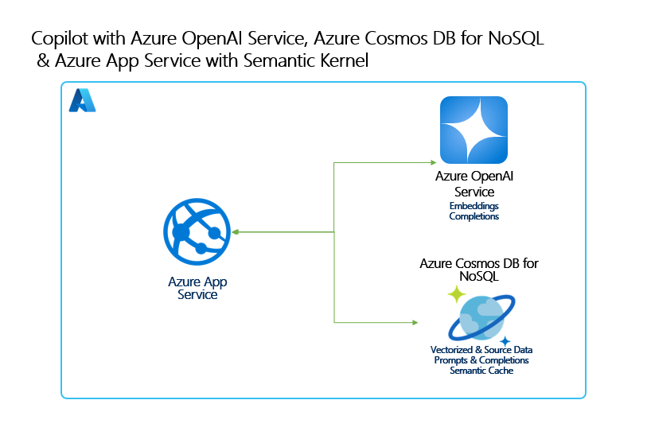
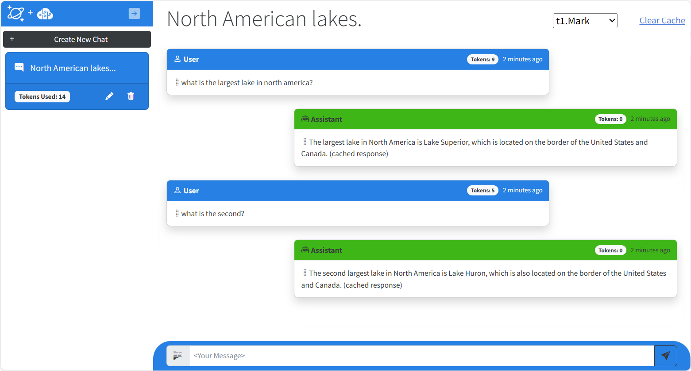

# Build a Copilot app using Azure Cosmos DB for NoSQL, Azure OpenAI Service, Semantic Kernel and .NET Aspire

This sample application shows how to build a multi-tenant, multi-user, Generative-AI RAG Pattern application using Azure Cosmos DB for NoSQL with its new vector database capabilities with Azure OpenAI Service built with .NET Aspire and hosted on Azure App Service. This sample shows both using Native SDKs as well as Semantic Kernel integration. The sample provides practical guidance on many concepts you will need to design and build these types of applications.

## Concepts Covered

This application demonstrates the following concepts and how to implement them:

- How to build a highly scalable, multi-tenant & user, Generative-AI chat application using Azure Cosmos DB for NoSQL.
- Generating completions and embeddings using Azure OpenAI Service.
- Managing a context window (chat history) for natural conversational interactions with an LLM.
- Manage per-request token consumption and payload sizes for Azure OpenAI Service requests.
- Building a semantic cache using Azure Cosmos DB for NoSQL vector search for improved performance and cost.
- Using the Semantic Kernel SDK for completion and embeddings generation.
- Implementing RAG Pattern using vector search in Azure Cosmos DB for NoSQL on custom data to augment generated responses from an LLM. 

### Architecture Diagram



### User Experience



## Getting Started

### Prerequisites

- Azure subscription. [Start free](https://azure.microsoft.com/free)
- Subscription access to Azure OpenAI service. Start here to [Request Access to Azure OpenAI Service](https://aka.ms/oaiapply). If you have access, see below for ensuring enough quota to deploy.
- Enroll in the [Azure Cosmos DB for NoSQL Vector Search Preview](https://learn.microsoft.com/azure/cosmos-db/nosql/vector-search#enroll-in-the-vector-search-preview-feature) (See below for more details)
- .NET 8 or above. [Download](https://dotnet.microsoft.com/download/dotnet/8.0)
- [Azure Developer CLI](https://aka.ms/azd-install)
- Visual Studio, VS Code, GitHub Codespaces or another editor to edit or view the source for this sample.


    #### Vector search Preview details
    This lab utilizes a preview feature, **Vector search for Azure Cosmos DB for NoSQL** which requires preview feature registration. Follow the below steps to register. You must be enrolled before you can deploy this solution:
    
    1. Navigate to your Azure Cosmos DB for NoSQL resource page.
    1. Select the "Features" pane under the "Settings" menu item.
    1. Select for “Vector Search in Azure Cosmos DB for NoSQL”.
    1. Read the description to confirm you want to enroll in the preview.
    1. Select "Enable" to enroll in the Vector Search preview.

    #### Checking Azure OpenAI quota limits

    For this sample to deploy successfully, there needs to be enough Azure OpenAI quota for the models used by this sample within your subscription. This sample deploys a new Azure OpenAI account with two models, **gpt-4o with 10K tokens** per minute and **text-3-large with 5k tokens** per minute. For more information on how to check your model quota and change it, see [Manage Azure OpenAI Service Quota](https://learn.microsoft.com/azure/ai-services/openai/how-to/quota)

### Instructions

1. Open a terminal and navigate to where you would like to clone this solution

1. Run the following command to download:

    ```bash
    azd init -t AzureCosmosDB/cosmosdb-nosql-copilot
    ```

1. From the terminal, navigate to the /infra directory in this solution.

1. Log in to AZD.
    
    ```bash
    azd auth login
    ```

1. Deploy the services to Azure, build your container, and deploy the application.
    
    ```bash
    azd up
    ```

### Quickstart

This solution has a number of quickstarts than you can run through to learn about the features in this sample and how to implement them yourself.

Please see [Quickstarts](quickstart.md)


## Clean up

1. Open a terminal and navigate to the /infra directory in this solution.

1. Type azd down
    
    ```bash
    azd down
    ```

## Resources

To learn more about the services and features demonstrated in this sample, see the following:

- [Azure Cosmos DB for NoSQL Vector Search announcement](https://aka.ms/CosmosDBDiskANNBlog/)
- [Azure OpenAI Service documentation](https://learn.microsoft.com/azure/cognitive-services/openai/)
- [Semantic Kernel](https://learn.microsoft.com/semantic-kernel/overview)
- [Azure App Service documentation](https://learn.microsoft.com/azure/app-service/)
- [ASP.NET Core Blazor documentation](https://dotnet.microsoft.com/apps/aspnet/web-apps/blazor)
