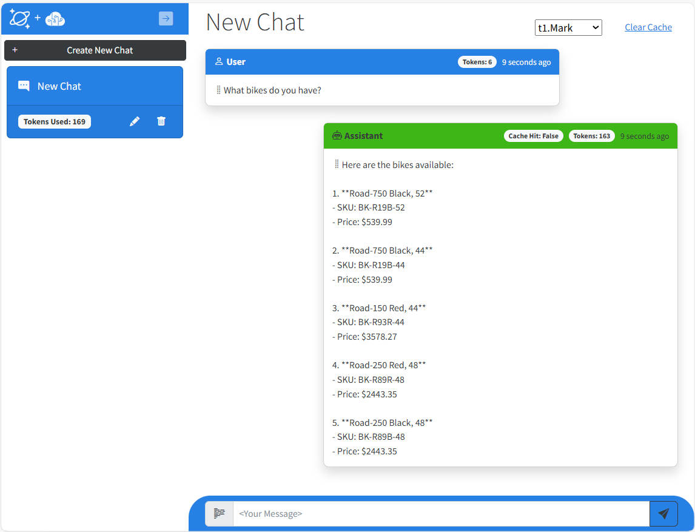

# Build a Copilot app using Azure Cosmos DB for NoSQL, Azure OpenAI Service, Azure App Service, Semantic Kernel and .NET Aspire

[](https://codespaces.new/AzureCosmosDB/cosmosdb-nosql-copilot)
[](https://vscode.dev/redirect?url=vscode://ms-vscode-remote.remote-containers/cloneInVolume?url=https://github.com/AzureCosmosDB/cosmosdb-nosql-copilot)

This sample application shows how to build a multi-tenant, multi-user, Generative-AI RAG Pattern application using Azure Cosmos DB for NoSQL with its new vector database, full-text and hybrid query capabilities with Azure OpenAI Service on Azure App Service. This sample shows both using Native SDKs as well as Semantic Kernel integration. It also integrates with .NET Aspire on .NET 8. The sample provides practical guidance on many concepts you will need to design and build these types of applications.

## Important Security Notice

This template, the application code and configuration it contains, has been built to showcase Microsoft Azure specific services and tools. We strongly advise our customers not to make this code part of their production environments without implementing or enabling additional security features.

## Features

This application demonstrates the following concepts and how to implement them:

- How to build a highly scalable, multi-tenant & user, Generative-AI chat application using Azure Cosmos DB for NoSQL.
- Generating completions and embeddings using Azure OpenAI Service.
- Managing a context window (chat history) for natural conversational interactions with an LLM.
- Manage per-request token consumption and payload sizes for Azure OpenAI Service requests.
- Building a semantic cache using Azure Cosmos DB for NoSQL vector search for improved performance and cost.
- Using the Semantic Kernel SDK for completion and embeddings generation.
- Implementing RAG Pattern using vector search in Azure Cosmos DB for NoSQL on custom data to augment generated responses from an LLM.
- Implementing RAG Pattern using hybrid search (vector and full-text search) in Azure Cosmos DB for NoSQL.

### Architecture Diagram


### User Experience



## Getting Started

### Prerequisites

- Azure subscription.
- Subscription access to Azure OpenAI service. Start here to [Request Access to Azure OpenAI Service](https://aka.ms/oaiapply). If you have access, see below for ensuring enough quota to deploy.
- .NET 8 or above. [Download](https://dotnet.microsoft.com/download/dotnet/8.0)
- [Azure Developer CLI](https://aka.ms/azd-install)
- Visual Studio, VS Code, GitHub Codespaces or another editor to edit or view the source for this sample.

#### Deploying Azure OpenAI supported regions

The models used for this sample are **gpt-4o** and **text-3-large**. These models are not deployed in all regions and are not always present in the same region. The regions shown in the main.bicep are the known regions both models are supported in at the time this readme was last updated. To check if these models are available in additional regions, see [Azure OpenAI Service Models](https://learn.microsoft.com/azure/ai-services/openai/concepts/models)

#### Checking Azure OpenAI quota limits

For this sample to deploy successfully, there needs to be enough Azure OpenAI quota for the models used by this sample within your subscription. This sample deploys a new Azure OpenAI account with two models, **gpt-4o with 10K tokens** per minute and **text-3-large with 5k tokens** per minute. For more information on how to check your model quota and change it, see [Manage Azure OpenAI Service Quota](https://learn.microsoft.com/azure/ai-services/openai/how-to/quota)

#### Azure Subscription Permission Requirements

This solution deploys [user-assigned managed identities](https://learn.microsoft.com/entra/identity/managed-identities-azure-resources/overview) and defines then applies Azure Cosmos DB RBAC permissions to this identity. At a minimum you will need the following Azure RBAC roles assigned to your identity in your Azure subscription or [Subscription Owner](https://learn.microsoft.com/azure/role-based-access-control/built-in-roles/privileged#owner) access which will give you both of the following.

- [Manged Identity Contributor](https://learn.microsoft.com/azure/role-based-access-control/built-in-roles/identity#managed-identity-contributor)
- [DocumentDB Account Contributor](https://learn.microsoft.com/azure/role-based-access-control/built-in-roles/databases#documentdb-account-contributor)

#### Full-Text & Hyrbrid Search Feature

Full-text and hybrid search in Azure Cosmos DB is in Preview and only available to a subset of regions at this time. This feature is commented out in the GetChatCompletionAsync() function in the ChatService. To use this feature you must deploy this sample in either `northcentralus` or `uksouth`.

To utilize this feature during preview, update **main.bicep** in the section below and enter either of the two regions listed above as the value for `location`

```bicep
module database 'app/database.bicep' = {
  name: 'database'
  scope: resourceGroup
  params: {
    accountName: !empty(cosmosDbAccountName) ? cosmosDbAccountName : '${abbreviations.cosmosDbAccount}-${resourceToken}'
    location: 'northcentralus'
    tags: tags
  }
}
```

### GitHub Codespaces

You can run this template virtually by using GitHub Codespaces. The button will open a web-based VS Code instance in your browser:

1. Open the template (this may take several minutes):

    [](https://codespaces.new/AzureCosmosDB/cosmosdb-nosql-copilot)

2. Open a terminal window
3. Continue with the [deploying steps](#deployment)

### Local Environment

If you're not using one of the above options for opening the project, then you'll need to:

1. Make sure the following tools are installed:

    * [.NET 8](https://dotnet.microsoft.com/downloads/)
    * [Git](https://git-scm.com/downloads)
    * [Azure Developer CLI (azd)](https://aka.ms/install-azd)
    * [VS Code](https://code.visualstudio.com/Download) or [Visual Studio](https://visualstudio.microsoft.com/downloads/)
        * If using VS Code, install the [C# Dev Kit](https://marketplace.visualstudio.com/items?itemName=ms-dotnettools.csdevkit)

2. Download the project code:

    ```shell
    azd init -t cosmosdb-nosql-copilot
    ```

3. If you're using Visual Studio, open the src/cosmos-copilot.sln solution file. If you're using VS Code, open the src folder.

7. Continue with the [deploying steps](#deployment).

### VS Code Dev Containers

A related option is VS Code Dev Containers, which will open the project in your local VS Code using the [Dev Containers extension](https://marketplace.visualstudio.com/items?itemName=ms-vscode-remote.remote-containers):

1. Start Docker Desktop (install it if not already installed)
2. Open the project:

    [](https://vscode.dev/redirect?url=vscode://ms-vscode-remote.remote-containers/cloneInVolume?url=https://github.com/AzureCosmosDB/cosmosdb-nosql-copilot)

3. In the VS Code window that opens, once the project files show up (this may take several minutes), open a terminal window.

4. Continue with the [deploying steps](#deployment)

### Deployment

1. Open a terminal and navigate to where you would like to clone this solution

1. Run the following command to download the solution locally to your machine:

   ```bash
   azd init -t AzureCosmosDB/cosmosdb-nosql-copilot
   ```

1. From the terminal, navigate to the /infra directory in this solution.

1. Log in to AZD.

   ```bash
   azd auth login
   ```

1. Provision the Azure services, build your local solution container, and deploy the application.

   ```bash
   azd up
   ```

1. Follow the prompts for the subscription and select a region to deploy. **NOTE:** If intending to use the Full-Text or Hybrid search feature please see [Full-Text & Hyrbrid Search Feature](#full-text--hyrbrid-search-feature)

### Setting up local debugging

When you deploy this solution it automatically injects endpoints and configuration values into the secrets.json file used by .NET applications.

To modify values for the Quickstarts, locate the value of `UserSecretsId` in the csproj file in the /src folder of this sample and save the value.

```xml
<PropertyGroup>
  <UserSecretsId>your-guid-here</UserSecretsId>
</PropertyGroup>
```

Locate the secrets.json file and open with a text editor.

- Windows: `C:\Users\<YourUserName>\AppData\Roaming\Microsoft\UserSecrets\<UserSecretsId>\secrets.json`
- macOS/Linux: `~/.microsoft/usersecrets/<UserSecretsId>/secrets.json`

### Quickstart

Follow the Quickstarts in this solution to go through the concepts for building RAG Pattern apps and the features in this sample and how to implement them yourself.

Please see [Quickstarts](quickstart.md)

## Clean up

1. Open a terminal and navigate to the /infra directory in this solution.

1. Type azd down (--force and --purge ensure the Azure OpenAI models are deleted)

   ```bash
   azd down --force --purge
   ```

## Guidance

### Region Availability

This template uses gpt-4o and text-embedding-3-large models which may not be available in all Azure regions. Check for [up-to-date region availability](https://learn.microsoft.com/azure/ai-services/openai/concepts/models#standard-deployment-model-availability) and select a region during deployment accordingly
  * We recommend using `eastus2', 'eastus', 'japaneast', 'uksouth', 'northeurope', or 'westus3'

### Costs

You can estimate the cost of this project's architecture with [Azure's pricing calculator](https://azure.microsoft.com/pricing/calculator/)

As an example in US dollars, here's how the sample is currently built:

Average Monthly Cost:
* Azure Cosmos DB Serverless ($0.25 USD per 1M RU/s): $0.25
* Azure App Service (B1 Plan): $12.41
* Azure OpenAI (GPT-4o 1M input/output tokens): $20 (Sample uses 10K tokens)
* Azure OpenAI (text-3-large): < $0.01 (Sample uses 5K tokens)

## Resources

To learn more about the services and features demonstrated in this sample, see the following:

- [Azure Cosmos DB for NoSQL Vector Search announcement](https://aka.ms/VectorSearchGaFtsPreview)
- [Azure OpenAI Service documentation](https://learn.microsoft.com/azure/cognitive-services/openai/)
- [Semantic Kernel](https://learn.microsoft.com/semantic-kernel/overview)
- [Azure App Service documentation](https://learn.microsoft.com/azure/app-service/)
- [ASP.NET Core Blazor documentation](https://dotnet.microsoft.com/apps/aspnet/web-apps/blazor)
