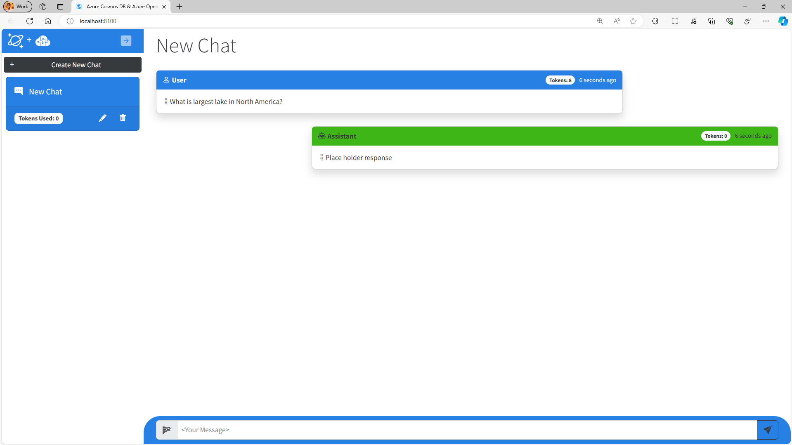
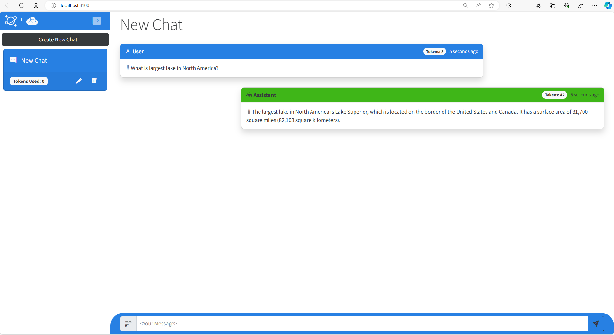
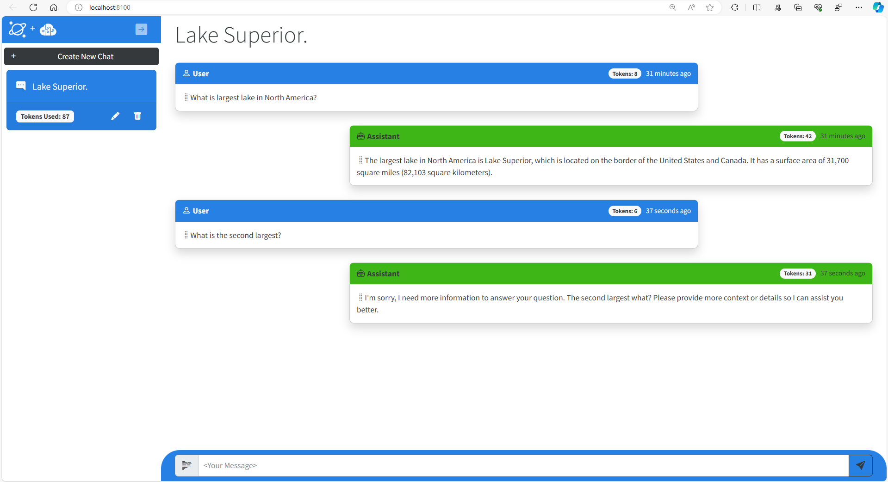
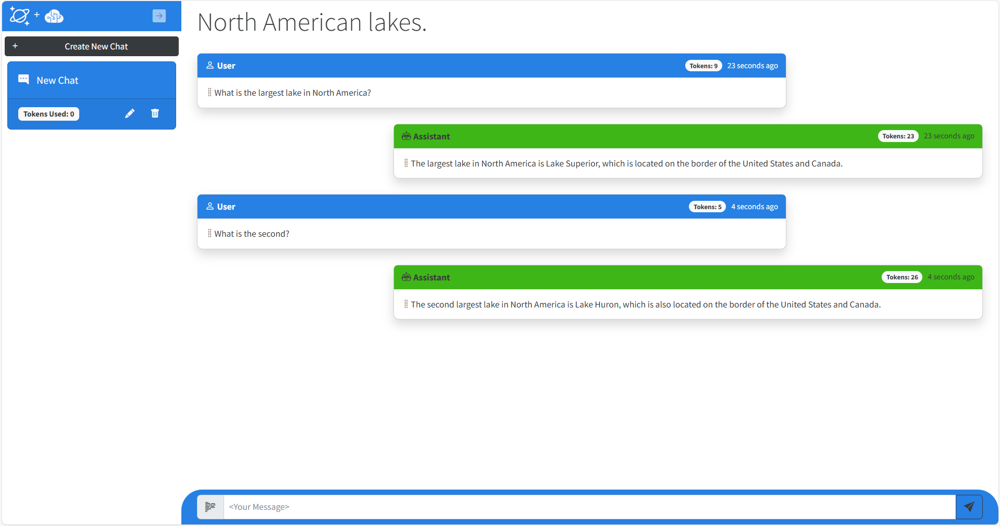
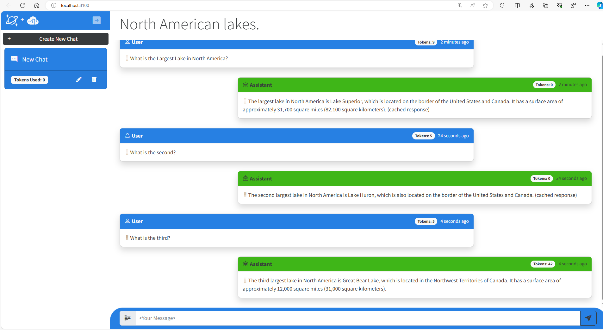

# Serverless GenAI Apps with Semantic Kernel, Azure Cosmos DB & .NET Aspire

In this hands-on lab, we will build serverless, AI RAG applications using .NET Aspire, Semantic Kernel and Azure Cosmos DB with DiskANN, vector search, and full-text search capabilities! You will learn how to implement Semantic Kernel Azure OpenAI Plug-ins, NoSQL connectors, and semantic caching! Gain practical insights into how to design, build, deploy and scale RAG pattern applications in Azure! The skills in this lab will give you a solid foundation to create your own generative AI applications. Its recommended to have C# or other programming language experience before completing this lab.


## What are we doing?

This lab guides you through the steps to implement generative AI capabilities for a ASP.NET Core Blazor application with Azure Cosmos DB for NoSQL and Azure OpenAI service integration using Semantic Kernel and .NET Aspire. These are the main tasks you will accomplish in this lab.

1. Connect to the application and explore the .NET Aspire dashboard. 
1. Implement Semantic Kernel to coordinate sending user prompts to a Chat GPT model in Azure OpenAI Service and store the responses in Azure Cosmos DB.
1. Implement and test a chat history feature to allow for more natural conversational interactions. 
1. Implement RAG Pattern using custom data for augmented LLM responses.
1. Implement and test a semantic cache for improved performance.


# Prepare // TODO: environment contains pre-deployed resources, consider deleting from lab

You're updating an existing .NET solution that has an ASP.NET Blazor application as its sole project. This project includes service classes using Azure Cosmos DB and Azure OpenAI that need to connect to the deployed services in Azure.

Before moving to the next step, ensure you have completed the **Service Deployment** as well as the **Configuring a lab environment** in the [README File](../README.md).

Once this is complete, you may begin the lab.


# Exercise: Setup and run the starter web application // TODO: update me!

The first step of this project is to ensure the existing starter application builds and runs successfully.

There are a few requirements in this exercise:

- Successfully build the application.
- Run the application using the **Hot Reload** feature of .NET

### Configure dev environment

The [Dev Containers extension](https://marketplace.visualstudio.com/items?itemName=ms-vscode-remote.remote-containers) for Visual Studio Code requires [Docker](https://docs.docker.com/) to be installed on your local machine. The extension hosts the development container locally using the Docker host with the correct developer tools and dependencies preinstalled to complete this training module.

This lab assumes the use of Visual Studio Code. However, you may use any IDE you wish.

1. Open a local **Terminal or Shell**. Change the current working directory where you cloned this application, for example, **C:\Users\Mark\Repos\cosmosdb-chatgpt\src**.

    ```bash
    cd C:\Users\Mark\Repos\cosmosdb-no-sql-copilot\src
    ```

1. Use the **devcontainer CLI** to open the current folder as a development container.

    ```bash
    devcontainer open
    ```

1. Within **Visual Studio Code**, open a new terminal.

**NOTE:** The remaining exercises in this hands-on lab take place in the context of this development container.

## Build and run the application for the first time

Now it's time to make sure the application works as expected. In this step, build the application to verify that there's no issues before we get started.

1. Open a new terminal.

1. Build the application using [dotnet build](https://learn.microsoft.com/dotnet/core/tools/dotnet-build).

    ```bash
    dotnet build
    ```

1. The Terminal should display a successful build.

1. At this point, your app has enough information to also run but not enough to generate a real response from an LLM. Let's run the application to make sure your code doesn't have any omissions or errors.

1. Return to the terminal in VS Code.

1. Run the .NET project.

    ```bash
    dotnet run
    ```

1. Visual Studio Code launches an in-tool simple browser with the web application running. In the web application, create a new chat session and ask the AI assistant this question, `What is the largest lake in North America?`. The AI assistant will respond with text, **"Place holder response"** and a token value of zero.



1. Close the terminal. (Click the garbage can icon.)


# Exercise: Implement the Azure OpenAI Service // TODO: update me!

Let's implement the Azure Open AI Service so we can generate real responses from an LLM. This service contains three methods but we will only focus on the one that generates the main responses in our chat. The other generates a summary of the conversation displayed in the UI and another generates embeddings that we will use in a later exercise.

## Generating completions from Azure OpenAI Service

We will implement the function that calls Azure OpenAI Service that generates a chat completion from an LLM for a given user prompt or question from a user. The function will return the text generated as well as the number of tokens to generate a response.

1. Open the **Services/OpenAiService.cs** file.

1. Within the **GetChatCompletionAsync()** method, comment out the existing placeholder code as seen below.

    ```csharp
    public async Task<(string completion, int tokens)> GetChatCompletionAsync(string sessionId, List<Message> conversation)
    {
        //await Task.Delay(0);
        //string completion = "Place holder response";
        //int tokens = 0;
    }
    ```
1. Create a string variable named **userMessage** that will do a string join on the **conversation** parameter. We will get to why this is a *List* object in a future exercise. At this point, it only contains a single user prompt.

    ```csharp
    string userMessage = string.Join(Environment.NewLine, conversation.Select(m => m.Prompt + " " + m.Completion));
    ```

1. Create a new variable named **ChatCompletionsOptions** object named **options**. Then add the code as seen below.

    ```csharp
    ChatCompletionsOptions options = new()
    {
        DeploymentName = _completionDeploymentName,
        Messages = {
            new ChatRequestSystemMessage(_systemPrompt),
            new ChatRequestUserMessage(userMessage)
        },
        User = sessionId,
        MaxTokens = 1000,
        Temperature = 0.2f,
        NucleusSamplingFactor = 0.7f
    };
    ```

1. Next we will call the Azure OpenAI service's **GetChatCompletionsAsync()** function with our local client instance and pass the options variable created above and get the result in a Response object. Add the code as seen below.

    ```csharp
    Response<ChatCompletions> completionsResponse = await _client.GetChatCompletionsAsync(options);
    ```

1. Next, we need to extract the completion text and tokens from the response object. Add the code as seen below.

    ```csharp
    ChatCompletions completions = completionsResponse.Value;
    string completion = completions.Choices[0].Message.Content;
    int tokens = completions.Usage.CompletionTokens;
    ```

1. Finally, ensure to return a tuple of the completion text and tokens for the function.

    ```csharp
    return (completion, tokens);
    ```

1. Once you have finished inserting all the code above, you can deleted the commented lines at the top of the function. 

1. Save the **Services/OpenAiService.cs** file.

## Check your work

At this point, your application has what must be implemented to test sample user prompts and completions generated by Azure OpenAI Service.

1. Open a new terminal and start the application using **dotnet run**.

    ```bash
    dotnet run
    ```

1. Visual Studio Code will launch the in-tool browser again with the web application running. 

1. In the web application, create a new chat session and ask the AI assistant this question, `What is the largest lake in North America?`. The AI assistant now responds with a completion created by Azure OpenAI Service saying that `Lake Superior` is the largest lake, with some additional information. You should also notice that the *token* UI fields are now populated with actual token usage for the completion.

     

1. Close the terminal. (Click the garbage can)

<details>
    <summary>Is your application not working or throwing exceptions? Click here to compare your code against this example.</summary>

</br>
 
Review the **GetChatCompletionAsync()** method of the **OpenAiService.cs** code file to make sure that your code matches this sample.
 
    ```csharp
    public async Task<(string completion, int tokens)> GetChatCompletionAsync(string sessionId, List<Message> conversation)
    {
        string userMessage = string.Join(Environment.NewLine, conversation.Select(m => m.Prompt + " " + m.Completion));
        ChatCompletionsOptions options = new()
        {
            Messages =
            DeploymentName = _completionDeploymentName,
            {
                new ChatRequestSystemMessage(_systemPrompt),      
                new ChatRequestUserMessage(userMessage)
            },
            User = sessionId,
            MaxTokens = 4000,
            Temperature = 0.2f,
            NucleusSamplingFactor = 0.7f
        };
        Response<ChatCompletions> completionsResponse = await _client.GetChatCompletionsAsync(options);
        ChatCompletions completions = completionsResponse.Value;
        string completion = completions.Choices[0].Message.Content;
        int tokens = completions.Usage.CompletionTokens;
        return (completion, tokens);
    }
    ```
</details>


# Exercise: Implement Chat History (Context Window)

We have the basics for our Generative AI application now in place. Next let's test further and explore how well it responds to natural language interactions.

## Test contextual follow up questions

Humans interact with each other through conversations that have some *context* of what is being discussed. OpenAI's ChatGPT can also interact this way with humans. However, this capability is not native to an LLM itself. It must be implemented. Let's explore what happens when we test contextual follow up questions with our LLM where we ask follow up questions that imply an existing context like you would have in a conversation with another person.

1. Open a new terminal and start the application using **dotnet run**.

    ```bash
    dotnet run
    ```

1. In the web application, create a new chat session and ask the AI assistant the same question again, `What are the most expensive bikes?`. And wait for the response, "24K Gold Extreme Mountain Bike" priced at $1 million. 

1. Ask this follow up question. `What about the least expensive?`. The response generated should look like the one below and will either have nothing to do with your first question, or the LLM may respond it needs more context to give you an answer.

      // TODO: update this image!

This demonstrates that LLM's are stateless. They do not maintain any conversation history by themselves and are missing the context necessary for the LLM to respond appropriately to your second question.

In this exercise we will show how to implement chat history, often called a **Context Window** for a Generative AI application. Before we write the code, we need to explain the concept of tokens for an LLM and why these are important to consider when implementing a context window.

## Tokens in Large Language Models

Large language models require chat history to generate contextually relevant results. But large language models have limits on how much text they can process in a request and output in a response. These limits are not expressed as words, but as **tokens**. Tokens represent words or part of a word. On average 4 characters is one token. Tokens are essentially the compute currency for a large language model.

It is necessary to manage the usage of tokens within your app to stay within the LLM's limits. This can be a bit tricky in certain scenarios. You need to provide enough context for the LLM to generate a correct response, while avoiding negative results of consuming too many tokens such as getting incomplete results or unexpected behavior.

To limit the maximum amount of chat history (and text) we send to our LLM, we will count the number of user prompts we send to the LLM as context. This app uses a variable `_maxContextWindow` to manage the limit for each request.

## Building a context window using tokens

For this exercise we will implement the **GetChatSessionContextWindow()** function in the **Services/ChatService.cs** class and modify another function, **GetChatCompletionAsync()** that will call the first function to build our chat history.

1. Within the **ChatService.cs** class locate the **GetChatSessionContextWindow()** method with the following signature. 

    ```csharp
        private async Task<List<Message>> GetChatSessionContextWindow(string tenantId, string userId, string sessionId)
    ```

1. Comment out the placeholder lines in this function and add the code below. The **allMessages** variable stores the entire chat history for a session fetched from the Cosmos DB Service. We use the `_maxContextWindow` setting to take the most recent messages in the conversation and return them as the context window for the conversation. Recency matters in a conversation, the most recent text is what we want closer to the actual question. Counting the number of messages allows us to control the total number of tokens used while still providing relevant context.

    ```csharp
    //await Task.Delay(0);
    //return new List<Message>();
    
    List<Message> allMessages = await _cosmosDbService.GetSessionMessagesAsync(tenantId, userId, sessionId);
 
    //Build the contextWindow from allMessages, start from the end and work backwards
    //This includes the latest user prompt which is already cached
    return allMessages.TakeLast(_maxContextWindow).ToList();
    ```

1. Next, within the **ChatService.cs** class, locate **GetChatCompletionAsync()** with the following signature. 

    ```csharp
    public async Task<Message> GetChatCompletionAsync(string tenantId, string userId, string sessionId, string promptText)
    ```

1. Find the two lines below initializing the **chatMessage** variable and comment them out. Then add the two new lines as seen below. This calls the the function to get the context window that we just updated, and passes the context window to the Semantic Kernel Service to get a completion from Azure OpenAI.

    ```csharp
    //List<Message> messages = new List<Message>() { chatMessage };
    //(chatMessage.Completion, chatMessage.CompletionTokens) = await _semanticKernelService.GetChatCompletionAsync(messages);

    //Grab context window from the conversation history up to the maximum conversation depth
    List<Message> contextWindow = await GetChatSessionContextWindow(tenantId, userId, sessionId);
    (chatMessage.Completion, chatMessage.CompletionTokens) = await _semanticKernelService.GetChatCompletionAsync(contextWindow);
    ```

1. Save the **Services/ChatService.cs** file.

## Check your work // TODO: update me

You are now ready to test your context window implementation.

1. Open a new terminal and start the application using **dotnet run**.

    ```bash
    dotnet run
    ```

1. Visual Studio Code will launch the in-tool simple browser again with the web application running. 

1. In the web application, create a new chat session and ask the AI assistant this question, `What is the largest lake in North America?`. The AI assistant now responds with a completion created by the model saying that `Lake Superior` is the largest lake, with some additional information. Now the second question again, `What is the second largest?`. You should see the response as `Lake Huron` which is the correct response.
 
 

1. Close the terminal. (click the garbage can icon)

<details>
    <summary>Is your application not working or throwing exceptions? Click here to compare your code against this example.</summary>

</br>
 
Review the **GetChatCompletionAsync** method of the **ChatService.cs** code file to make sure that your code matches this sample.
 
    ```csharp
    public async Task<Message> GetChatCompletionAsync(string tenantId, string userId, string sessionId, string promptText)
    {
        ArgumentNullException.ThrowIfNull(tenantId);
        ArgumentNullException.ThrowIfNull(userId);
        ArgumentNullException.ThrowIfNull(sessionId);

       //Create a message object for the new user prompt and calculate the tokens for the prompt
        Message chatMessage = await CreateChatMessageAsync(tenantId, userId, sessionId, promptText);

        //Grab context window from the conversation history up to the maximum configured tokens
        List<Message> contextWindow = await GetChatSessionContextWindow(tenantId, userId, sessionId);
        (chatMessage.Completion, chatMessage.CompletionTokens) = await _semanticKernelService.GetChatCompletionAsync(sessionId, contextWindow);

        await UpdateSessionAndMessage(tenantId, userId, sessionId, chatMessage);

        return chatMessage;
    }
    ```
</details>


# Exercise: Implement the RAG Pattern

In this exercise we will implement the RAG Pattern for our application. RAG is short for Retrieval Augmented Generation which is a fancy way of saying that the LLM will generate a completion using data retrieved elsewhere. The source of this data can be anything including files or data from a database. Typically the data is the result of a search for semantically relevant results to what the user is asking for. This often involves the use of a vector search against a database. The results of that search are passed with the context window and user prompt to then generate a response. 

This workflow for RAG Pattern generally maps to the following steps:

1. User types in a user prompt or question.
1. The user prompt is vectorized by an embeddings model and returned as an array of vectors.
1. These vectors are used in a vector search against a database. Results are returned ordered by semantic similarity.
1. The search results, the context window (chat history), and the latest user prompt are sent to the LLM.
1. The LLM processes all of the text in the payload and generates a response.

## Vector Search on user data

The first step is to implement the vector search query in our application.

1. Navigate to the **SemanticKernelService.cs** class and locate the **SearchProductsAsync()** function with the following signature. 

    ```csharp
    public async Task<string> SearchProductsAsync(ReadOnlyMemory<float> promptVectors, int productMaxResults)
    ```

1. Instead of writing a custom vector query to execute against our container, we can leverage Semantic Kernel's Azure Cosmos DB NoSQL Vector Store connector. This greatly reduces the amount of code we need to write in order to search our product data for relevant results. Comment out the two lines of code below, and add the following lines.

    ```csharp
    //string productsString = "";
    //await Task.Delay(0);

    var options = new VectorSearchOptions { VectorPropertyName = "vectors", Top = productMaxResults };

    //Call Semantic Kernel to perform the vector search
    var searchResult = await _productContainer.VectorizedSearchAsync(promptVectors, options);
    ```

    This code does a few things including:

    1. Uses `VectorPropertyName` in the `VectorSearchOptions` to indicate which property in the Azure Cosmos DB document contains the vectors to search against.
    1. Uses `Top` to limit the number of products that are returned by the search. Because LLM's can only process so much text at once, it is necessary to limit the amount of data returned by a vector search. The `productMaxResults` value limits that amount of data and because this is something you will need to adjust when doing vector searches, it is config value in this application.
    1. Calls the `VectorizedSearchAsync()` function in the Semantic Kernel connector to perform vector search using the passed-in vectors generated by the user prompt. This automatically orders the results by the similarity score from most semantically relevant to least relevant.

1. After this block of code, add the following lines before the existing return statement. This loops through the vector search results and serializes all products as a single string.

    ```csharp
    var resultRecords = new List<VectorSearchResult<Product>>();
    await foreach (var result in searchResult.Results)
    {
        resultRecords.Add(result);
    }

    string productsString = JsonSerializer.Serialize(resultRecords);
    return productsString;
    ```
    
1. Save the **SemanticKernelService.cs** file.

## System Prompts and Generating the Completion

We need to modify the LLM payload for generating the completion to include our new vector search results data. We also need to modify the system prompt we use to instruct the LLM on how to generate the completion.

1. Back in the **SemanticKernelService.cs** class, locate the **_systemPromptRetailAssistant** variable. Modify it to include our new system prompt, as seen below.

    ```csharp
    private readonly string _systemPromptRetailAssistant = @"
        You are an intelligent assistant for the Cosmic Works Bike Company. 
        You are designed to provide helpful answers to user questions about 
        bike products and accessories provided in JSON format below.

        Instructions:
        - Only answer questions related to the information provided below,
        - Don't reference any product data not provided below.
        - If you're unsure of an answer, you can say ""I don't know"" or ""I'm not sure"" and recommend users search themselves.

        Text of relevant information:";
    ```

    Compare this system prompt to our original `_systemPrompt`. Both are similar in providing information for how the AI Agent should behave. However, the new system prompt provides greater context and a clear list of instructions for what it is supposed to do. It also provides a placeholder for where it expects to see additional information. 

1. We next need to modify the function that will call the LLM. Locate the **GetRagCompletionAsync()** function in **SemanticKernelService.cs** with the following signature.

    ```csharp
    public async Task<(string completion, int generationTokens, int completionTokens)> GetRagCompletionAsync(List<Message> contextWindow, string ragData)
    ```

1. At the top of the function, add a new line to trim the incoming product search data based on the `_maxRagTokens` configuration. This uses a tokenizer from Semantic Kernel to help us control the number of tokens we're consuming for each request. 

    ```csharp
    //Manage token consumption per request by trimming the amount of vector search data sent to the model
    ragData = TrimToTokenLimit(_maxRagTokens, ragData);
    ```

    Notice the foreach loop lower down in this function is also helping us control the number of tokens consumed by limiting the number of prior messages added from our context window.

1. Below `ragData`, locate the **skChatHistory** variable. Then add the second line below to set the new system message. This is where the vector search results are sent to the LLM and appended as part of the system prompt that we defined with the placeholder for additional information.

    ```csharp
    var skChatHistory = new ChatHistory();
    skChatHistory.AddSystemMessage(_systemPromptRetailAssistant + ragData);
    ```

1. Save the **SemanticKernelService.cs** file.

## Putting it all together

The last step for our RAG Pattern implementation is to modify our LLM pipeline function in our application so that it generates embeddings from the user prompt, executes the vector search to find relevant products to those embeddings, and calls our new rag chat completion function to generate the response.

1. Navigate to the **ChatService.cs** class and locate the **GetChatCompletionAsync()** function with the following signature.

    ```csharp
    public async Task<Message> GetChatCompletionAsync(string tenantId, string userId, string sessionId, string promptText)
    ```

1. First, we need to get vector embeddings from the user prompts. Below the call to get the context window, add two lines to concatenate the context window as one string and to generate vector embeddings. This call to `GetEmbeddingsAsync()` generates vector embeddings out of the user prompt using Semantic Kernel and Azure OpenAI.

    ```csharp
        //Grab context window from the conversation history up to the maximum conversation depth
        List<Message> contextWindow = await GetChatSessionContextWindow(tenantId, userId, sessionId);

        //Grab the user prompts for the context window
        string prompts = string.Join(Environment.NewLine, contextWindow.Select(m => m.Prompt));

        //Get the embeddings for the user prompts
        float[] promptVectors = await _semanticKernelService.GetEmbeddingsAsync(prompts);
    ```

1. Directly under these lines, add the line to create **vectorSearchResults** with the value from the `SearchProductsAsync()` function we completed earlier.

    ```csharp
    //RAG Pattern Vector search results for product data
    string vectorSearchResults = await _semanticKernelService.SearchProductsAsync(promptVectors, _productMaxResults);
    ```

1. Lastly, we will comment out the call to **GetChatCompletionAsync()** and replace with a call to our new function **GetRagCompletionAsync()** that takes vectors returned from our product search above.

    ```csharp
    //(chatMessage.Completion, chatMessage.CompletionTokens) = await _semanticKernelService.GetChatCompletionAsync(contextWindow);
    
    //Call Semantic Kernel to do a vector search generate a new completion
    (chatMessage.Completion, chatMessage.GenerationTokens, chatMessage.CompletionTokens) = await _semanticKernelService.GetRagCompletionAsync(contextWindow, vectorSearchResults);
    ```

1. Save the **ChatService.cs** file.

## Check your work // TODO: update me

At this point, your application is ready to test our RAG Pattern implementation. Let's run our application and test it.

1. Return to the terminal and run it using **dotnet run**.

    ```bash
    dotnet run
    ```

1. Visual Studio Code launches the in-tool simple browser again with the web application running. 

1. First we will test our RAG Pattern app with its new vector search, system prompt and response generation. In the web application, create a new chat session and ask, `What bikes do you have?`. The AI assistant should respond with a list of bikes available from the product catalog. 

1. Next, let's ask a follow up question. `Do you have any bikes in red?`. The AI assistant should then respond with a list of bikes available in red only.

    Let's also test the semantic cache with our new RAG Pattern. Semantic cache is a valuable feature to have in a RAG Pattern application because the amount of tokens required to generate responses from the increased amount of text and data can be much greater. It also takes longer to generate the responses. Serving responses from the cache will save on both.

1. In the web application, create a new chat session and ask, `What bikes do you have?`. The AI assistant should respond with the same list of bikes available from the product catalog with *(cached response)* appended to the response and zero tokens consumed. The response should also be noticeably quicker than before when it has to execute a vector search and generate the response from the LLM.

1. Close the terminal.

<details>
    <summary>Is your application not working or throwing exceptions? Click here to compare your code against this example.</summary>

</br>

If you get responses indicating there was no data to generate a response, the vector search is likely not working as expected. Navigate to the **SemanticKernelService** and locate the `SearchProductsAsync()` method to make sure that your code matches this sample.
 
    ```csharp
    public async Task<string> SearchProductsAsync(ReadOnlyMemory<float> promptVectors, int productMaxResults)
    {
        var options = new VectorSearchOptions { VectorPropertyName = "vectors", Top = productMaxResults };

        //Call Semantic Kernel to perform the vector search
        var searchResult = await _productContainer.VectorizedSearchAsync(promptVectors, options);

        var resultRecords = new List<VectorSearchResult<Product>>();
        await foreach (var result in searchResult.Results)
        {
           resultRecords.Add(result);
        }

        string productsString = JsonSerializer.Serialize(resultRecords);
        return productsString;
    }
    ```

If you get other strange behavior for the completion, it's possible the system prompt is not correct. In the **SemanticKernelService** locate the system prompts at the top of the class. Review `_systemPromptRetailAssistant` variable to make sure that your code matches this sample.
 
    ```csharp
    private readonly string _systemPromptRetailAssistant = @"
    You are an intelligent assistant for the Cosmic Works Bike Company. 
    You are designed to provide helpful answers to user questions about 
    bike products and accessories provided in JSON format below.

    Instructions:
    - Only answer questions related to the information provided below,
    - Don't reference any product data not provided below.
    - If you're unsure of an answer, you can say ""I don't know"" or ""I'm not sure"" and recommend users search themselves.

    Text of relevant information:";
    ```

Finally, if the responses do not include any information on the bike products being asked, it's possible the call to Azure OpenAI Service is not correct. In the **SemanticKernelService** locate the `GetRagCompletionAsync()` method to make sure that your code matches this sample.
 
    ```csharp
    public async Task<(string completion, int generationTokens, int completionTokens)> GetRagCompletionAsync(List<Message> contextWindow, string ragData)
    {
        //Manage token consumption per request by trimming the amount of vector search data sent to the model
        ragData = TrimToTokenLimit(_maxRagTokens, ragData);

        //Add the system prompt and vector search data to the chat history
        var skChatHistory = new ChatHistory();
        //skChatHistory.AddSystemMessage(_systemPromptRetailAssistant + ragData);

        //Manage token consumption by trimming the amount of chat history sent to the model
        //Useful if the chat history is very large. It can also be summarized before sending to the model
        int currentTokens = 0;

        foreach (var message in contextWindow)
        {
            //Add up to the max tokens allowed
            if ((currentTokens += message.PromptTokens + message.CompletionTokens) > _maxContextTokens) break;
            
            skChatHistory.AddUserMessage(message.Prompt);
            if (message.Completion != string.Empty)
                skChatHistory.AddAssistantMessage(message.Completion);
            
        }

        PromptExecutionSettings settings = new()
        {
            ExtensionData = new Dictionary<string, object>()
            {
                { "temperature", 0.2 },
                { "top_p", 0.7 },
                { "max_tokens", 1000  }  //TODO: This doesn't appear to do anything
            }
        };

        var result = await kernel.GetRequiredService<IChatCompletionService>().GetChatMessageContentAsync(skChatHistory, settings);

        ChatTokenUsage completionUsage = (ChatTokenUsage)result.Metadata!["Usage"]!;

        string completion = result.Items[0].ToString()!;

        //Separate the amount of tokens used to process the completion vs. the tokens used on the returned text of the completion
        //The completion text is fed into subsequent requests so want an accurate count of tokens for that text in case
        int generationTokens = completionUsage.TotalTokenCount - completionUsage.OutputTokenCount;
        int completionTokens = completionUsage.OutputTokenCount;
        
        return (completion, generationTokens, completionTokens);
    }
    ```
</details>


# Exercise: Implement a Semantic Cache

Large language models are amazing with their ability to generate completions to a user's questions. However, these requests to generate completions from an LLM are computationally expensive (expressed in tokens) and can also be quite slow. This cost and latency increases as the amount of text increases. 

Applications following the RAG Pattern use data from a database to augment or *ground* the LLM by providing additional information to generate a more contextual response. Payloads now must include the user prompt, conversation history, and additional data from the database, which can get rather large. It is not uncommon to consume thousands of tokens and wait for 5+ seconds for a response for large payloads. In a world where milliseconds count, waiting several seconds is often an unacceptable user experience.

Thankfully, we can create a cache for this type of solution to reduce both cost and latency for repeated prompts. In this exercise, we will introduce a specialized cache called a **semantic cache**. Traditional caches are key-value pairs and use an equality match on the key to *get* data. Keys for a semantic cache are vectors (or embeddings) which represent words in a high dimensional space where words with similar meaning or intent are in close proximity to each other dimensionally.

A cache **GET** is done with a specialized **vector query** comparing the proximity of these vectors to find matches. The results are the cached completions previously generated by an LLM and a **similarity score** that represents how close the vectors are to each other. Similarity values range from 0, no similarity, to 1, exact match. 

To execute a vector query for a semantic cache, user text is converted into vectors and then used as the filter predicate to search for similar vectors in the cache. For our semantic cache, we will create a query that returns just one result, and the similarity score helps dial in how close the user's intent and words are to the cache's key values. The greater the score, the more similar the words and intent. The lower the score, the less similar the words *and potentially* intent as well.

In practice, setting this value can be tricky. Too high, and the cache will fill up with multiple responses for very similar questions. Too low, and the cache will return irrelevant responses that do not satisfy the user.

Let's build our semantic cache using Azure Cosmos DB for NoSQL.

1. Locate the the **Services/CosmosDbService.cs** class. Then look for a function called, **CacheGetAsync()** with the signature below.

    ```csharp
    public async Task<string> CacheGetAsync(float[] vectors, double similarityScore)
    ```
    
1. Next, comment out the empty **queryText** and replace it with the vector search query. This query is what performs the search to find relevant items in our semantic cache. It selects only the closest match with an *ORDER BY*, so the item with highest similarity score (and the most similar to what is being searched) appears first. The results include a previously cached completion, and the similarity score for the cached item.

    ```csharp
    //string queryText = @"";
    string queryText = $"""
    SELECT Top 1 
        c.prompt, c.completion, VectorDistance(c.vectors, @vectors) as similarityScore
    FROM c  
    WHERE 
        VectorDistance(c.vectors, @vectors) > @similarityScore 
    ORDER BY 
        VectorDistance(c.vectors, @vectors)
    """;
    ```

1. Save the file.

1. Now we need to call this get cache function from the LLM pipeline. Within the **Services/ChatService.cs** class, locate the function, **GetChatCompletionAsync()** with the signature below. We will modify this function to search our semantic cache for user prompts with a similar intent to what is being asked. If we find a match, we can return the cached value to the user instead of making a new request to the LLM.

    ```csharp
    public async Task<Message> GetChatCompletionAsync(string tenantId, string userId, string sessionId, string promptText)
    ```

1. To query our cache for past responses to similar prompts, we need to execute vector search. Below the existing `promptVectors` declaration in the **GetChatCompletionAsync()** function, add a call to the get cache function that we just updated.

    ```csharp
    //Get the embeddings for the user prompts
    float[] promptVectors = await _semanticKernelService.GetEmbeddingsAsync(prompts);

    //Perform a cache search to see if this prompt has already been used in the same sequence and depth as this conversation
    string cacheResponse = await _cosmosDbService.GetCacheAsync(promptVectors, _cacheSimilarityScore);
    ```

1. Next, below the call to find cached responses you just added, add the following code. If `cacheResponse` isn't empty, that means we found a matching response to give the user and we can skip the rest of the function by returning the `chatMessage` to the user. If there wasn't a cache hit, this if statement is skipped and the rest of our LLM pipeline is executed to search for relevant products and generate a new completion using the Semantic Kernel Service.

    ```csharp
    //Cache hit, return the cached completion
    if (!string.IsNullOrEmpty(cacheResponse))
    {
        chatMessage.CacheHit = true;
        chatMessage.Completion = cacheResponse;

        //Persist the prompt/completion, elapsed time, update the session tokens
        await UpdateSessionAndMessage(tenantId, userId, sessionId, chatMessage);

        return chatMessage;
    }
    ```
    
1. Lastly, we need to update this function to store new prompts and completions in the cache. After the existing call to the Semantic Kernel Service getting the new completion, add a call to update the cache.

    ```csharp
    //Call Semantic Kernel to do a vector search generate a new completion
    (chatMessage.Completion, chatMessage.GenerationTokens, chatMessage.CompletionTokens) = await _semanticKernelService.GetRagCompletionAsync(contextWindow, vectorSearchResults);

    //Cache the prompts in the current context window and their vectors with the generated completion
    await CachePutAsync(prompts, promptVectors, chatMessage.Completion);
    ```

1. Save the file.

## Check your work // TODO: update me

1. This exercise had a lot of code. Before we test our new semantic cache, verify your code is correct. Click the "Compare your code against this sample" below to check if your code is correct.

<details>
    <summary>Compare your code against this example.</summary>

</br>
 
Review the **GetChatCompletionAsync()** method of the **ChatService.cs** code file to make sure that your code matches this sample.
 
    ```csharp
    public async Task<Message> GetChatCompletionAsync(string tenantId, string userId, string sessionId, string promptText)
    {
        //Create a message object for the new User Prompt and calculate the tokens for the prompt
        Message chatMessage = await CreateChatMessageAsync(tenantId, userId, sessionId, promptText);
        
        //Grab context window from the conversation history up to the maximum conversation depth
        List<Message> contextWindow = await GetChatSessionContextWindow(tenantId, userId, sessionId);

        //Grab the user prompts for the context window
        string prompts = string.Join(Environment.NewLine, contextWindow.Select(m => m.Prompt));

        //Get the embeddings for the user prompts
        float[] promptVectors = await _semanticKernelService.GetEmbeddingsAsync(prompts);

        //Perform a cache search to see if this prompt has already been used in the same sequence and depth as this conversation
        string cacheResponse = await _cosmosDbService.GetCacheAsync(promptVectors, _cacheSimilarityScore);

        //Cache hit, return the cached completion
        if (!string.IsNullOrEmpty(cacheResponse))
        {
           chatMessage.CacheHit = true;
           chatMessage.Completion = cacheResponse;

           //Persist the prompt/completion, elapsed time, update the session tokens
           await UpdateSessionAndMessage(tenantId, userId, sessionId, chatMessage);

           return chatMessage;
        }

        //RAG Pattern Vector search results for product data
        string vectorSearchResults = await _semanticKernelService.SearchProductsAsync(promptVectors, _productMaxResults);

        //Call Semantic Kernel to do a vector search generate a new completion
        (chatMessage.Completion, chatMessage.GenerationTokens, chatMessage.CompletionTokens) = await _semanticKernelService.GetRagCompletionAsync(contextWindow, vectorSearchResults);

        //Cache the prompts in the current context window and their vectors with the generated completion
        await CachePutAsync(prompts, promptVectors, chatMessage.Completion);

        //Persist the prompt/completion, elapsed time, update the session tokens
        await UpdateSessionAndMessage(tenantId, userId, sessionId, chatMessage);

        return chatMessage;
    }
    ```
</details>

At this point, we've implemented our semantic cache and are ready to test.

1. Open a new terminal and start the application using **dotnet run**.

    ```bash
    dotnet run
    ```

1. Visual Studio Code launches the in-tool simple browser again with the web application running. 

1. In the web application, create a new chat session and ask the AI assistant this question, `What is the largest lake in North America?`. The AI assistant now responds with a completion created by the model saying that `Lake Superior` is the largest lake, with some additional information. Next, ask the next follow up question as `What is the second largest?`. You should see the response as the 'Lake Huron'. Next ask one more question, `What is the third largest?`. You should see the response as `Great Bear` Lake with some additional information.

1. Next validate the Semantic cache is working. You should see a much faster response time with zero tokens consumed. Also cached responses will include, *(cached response)* appended in the response like this below.



1. To test we will repeat the above sequence with slightly modified prompts. We will also take the opportunity to adjust the similarity score to see its impact on how the cache works. We will start with a very strict similarity score of 0.99, then adjust it after some testing.

1. Start a new session and begin by modifying our original question and asking, `What is the biggest lake in North America?`. You will notice that it responds correctly, but it didn't hit the cache as there were tokens consumed.

1. Close the terminal to stop the application. (click the garbage can icon)

1. Open the the **appsettings.json** file in the project. Edit the **CacheSimilarityScore** value and adjust it from `0.99` to `0.95`. Save the file.

1. Open a new terminal and start the application using **dotnet run**.

    ```bash
    dotnet run
    ```

1. Start a new session and ask the same modified question again, `What is the biggest lake in North America?`. This time you will get a cache hit with zero tokens and the *(cached response)* appended to the response.

1. Next ask the follow up question, `What is the second largest?`. Here too you will get a cached response.

1. Spend a few minutes trying different sequences of questions (and follow up questions) and then modifying them with different similarity scores. If you want to start over and do multiple tests using the same series of questions you can click on **Clear Cache** in the app to empty the cache.

1. When you are done, close the terminal to stop the application. (click the garbage can icon)

## A semantic cache needs to have context // TODO: update me

If you haven't noticed by now, the semantic cache in this lab caches within the **context window** for a session. This is different from how traditional caches work. Just as we saw earlier in the lab, **context matters!** Caching a conversation ensures that what gets returned from the cache is contextually correct. If it didn't do this, users would get unexpected, and likely unacceptable responses.

Here is a simple mental exercise for a semantic cache that *does not* cache the context window. If you first ask an LLM, "What is the largest lake in North America?", it will respond "Lake Superior", then cache that user prompt and completion. If you then ask, "What is the second largest?", the context window we built earlier will pass the chat history to the LLM and it will correctly respond with, "Lake Huron". And the cache will cache that individual user prompt, "What is the second largest?" and the "Lake Huron" completion as well.

Now, say another user in a different session asked, "What is the largest stadium in North America?", the LLM will respond with, "Michigan Stadium with 107,601 seat capacity". If that user then asked, "What is the second largest?", the cache will return, "Lake Huron", which of course is incorrect.

It is for this reason a semantic cache must cache within a context window. The context window already provides contextual relevance for an LLM to generate completions. This makes it a logical choice for how the cache should work as well. Implementing this is easy as we are already managing our chat history for our app. We just send all the user prompts as a string to be vectorized, then store this with the completion that gets generated by the LLM. Then when any user comes along later, only those with the *same sequence of questions* within their context window will get that specific cached response.


# Summary

You have successfully implemented our new Generative AI application using Azure Cosmos DB and Azure OpenAI Service. You have learned new concepts for building Generative AI applications such as tokens, context windows, semantic caching, similarity scores and RAG Pattern.

With the SDKs for Azure Cosmos DB for NoSQL and Semantic Kernel including it's plug-ins and connectors, you were able to add these services to your application with little friction. The services you implemented illustrate the best practices for using each SDK across various operations. The .NET SDKs for each service made it possible to add the required functionality to your ASP.NET Core Blazor web application using .NET Aspire with lightweight method implementations.


## References

This hands on lab is available as a completed sample here, [Build a custom Copilot application](https://github.com/AzureCosmosDB/cosmosdb-nosql-copilot)

Take some time to explore the services and capabilities you saw today to get more familiar with them.

- **Semantic Kernel**
  - [Get started with semantic kernel](https://learn.microsoft.com/semantic-kernel/overview/)
- **Azure Cosmos DB Vector Search**
  - [Get started with vector search in Azure Cosmos DB](https://aka.ms/CosmosDBVectorSetup)


Take your knowledge even further. We have built a complete end-to-end RAG Pattern solution that takes this lab you did today and expands it to a fully functional, production grade solution accelerator. The solution has the same ASP.NET Blazor web interface and the back end is entirely built using the latest features from Semantic Kernel. The solution can be deployed to either AKS or Azure Container Apps, along with a host of other services designed for deploying production grade applications in Azure.

- **Official Microsoft Solution Accelerator for building RAG pattern applications**
  - [Build your own Copilot Solution Accelerator](https://github.com/Azure/BuildYourOwnCopilot)
