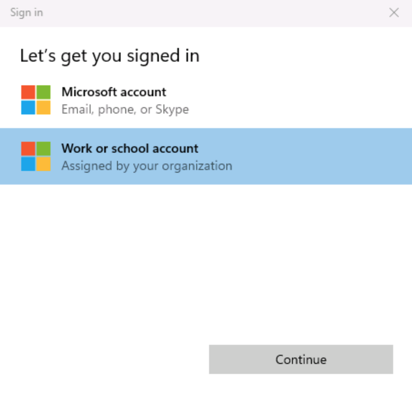

# Serverless GenAI Apps with Semantic Kernel, Azure Cosmos DB & .NET Aspire

In this hands-on lab, we will build serverless, AI RAG applications using .NET Aspire, Semantic Kernel and Azure Cosmos DB with DiskANN and vector search! You will learn how to implement Semantic Kernel Azure OpenAI extensions, NoSQL connectors, and semantic caching. Gain practical insights into how to design, build, deploy and scale RAG pattern applications in Azure! The skills in this lab will give you a solid foundation to create your own generative AI applications. Its recommended to have C# or other programming language experience before completing this lab.

## What are we doing?

This lab guides you through the steps to implement generative AI capabilities for an ASP.NET Core Blazor application with Azure Cosmos DB for NoSQL and Azure OpenAI service integration using Semantic Kernel and .NET Aspire. These are the main tasks you will accomplish in this lab.

1. Connect to the application and explore the .NET Aspire dashboard. 
1. Implement Semantic Kernel to coordinate sending user prompts to a Chat GPT model in Azure OpenAI Service and store the responses in Azure Cosmos DB.
1. Implement and test a chat history feature to allow for more natural conversational interactions. 
1. Implement RAG Pattern using custom data for augmented LLM responses.
1. Implement and test a semantic cache for improved performance.

---

# Exercise: Setup and run the starter web application

Before we implement new functionality in this project, we need to set up authentication and ensure the existing starter application builds and runs successfully. 

1. Open a local **Terminal** and change the current working directory to where the application has already been downloaded for you.

    ```bash
    cd C:\Users\Admin\Repos\cosmosdb-nosql-copilot\src
    ```

1. Open the project in Visual Studio Code with the following command.

    ```bash
    code .
    ```

1. Within Visual Studio Code, open a new terminal. You can open a new terminal using **Terminal > New Terminal** from the toolbar in VS Code or enter **CTRL + SHIFT + `**.

## Configure authentication

To access our Azure resources, we need to be authenticated from our terminal in Visual Studio Code. Then we need to set up the role assignments required to access Azure OpenAI and Azure Cosmos DB.

1. In the same terminal we just opened, change directories to **infra/scripts**.

    ```bash
    cd ../infra/scripts
    ```

1. Log in to the Azure CLI by entering the following command in the terminal window.

    ```bash
    az login
    ```

1. You will see a pop-up for choosing which account you want to sign in to. Select **Work or school account** and click **Continue**.

    

1. You should see a new pop-up asking you to sign in. Enter the **Username** and **Password** provided in the **Resources** tab of this lab environment. Ensure you use the Azure credentials provided, this is different than the username and password used to sign in to the VM. Your username should look something like `azureuser-45536656@LODSPRODMCA.onmicrosoft.com`. If you don't see this pop-up, you may need to minimize Visual Studio Code.

    

1. After entering your credentials, you should see a page asking you if you want to stay signed in to all your apps. Select **Ok**.

1. Then, you will see another page saying that you're all set. Select **Done**.

1. Finally, after all pop-ups have been cleared, confirm the subscription back in the terminal in Visual Studio Code. There will only be one subscription id listed, enter **1** in the terminal to confirm your subscription.

1. Now that we are authenticated to the Azure CLI, run the script to configure the necessary role assignments for your user. This will allow you to access Azure Cosmos DB and Azure OpenAI using Microsoft Entra ID.

    ```bash
    ./azd-role-assignments.sh
    ```

    You should see two output objects. The first is the role assignment for Azure OpenAI and the second is the role assignment for Azure Cosmos DB.

## Build and run the application for the first time

Now it's time to make sure the application works as expected. In this step, build the application to verify that there's no issues before we get started.

1. In the same terminal, change directories to `src/cosmos-copilot.AppHost`. The **AppHost** is the entry point for all .NET Aspire projects and it acts as an orchestrator for all of the dependent projects and services in your application. 

    ```bash
    cd ../../src/cosmos-copilot.AppHost
    ```

1. Before we run the application locally, we need to trust the https developer certificate that .NET will generate for us.

    ```bash
    dotnet dev-certs https --clean
    dotnet dev-certs https --trust
    ```

1. You will see another pop-up asking you if you want to install the certificate. Select **Yes**.

    

1. At this point, your app has enough information to run but not enough to generate a real response from an LLM. Let's run the application to make sure your code doesn't have any omissions or errors.

    ```bash
    dotnet run
    ```

1. Your output should look something like the image below. To test our application, launch the .NET Aspire Dashboard with `CTRL + click` on the dashboard link. This is the second localhost link and has the login information appended to the end of it. This link will automatically open the .NET Aspire Dashboard in a web browser.

    

    If you get a certificate not trusted message on the web browser, close the browser and `CTRL + click` on the dashboard link again.

1. The .NET Aspire dashboard has pages to manage all project resources, view console output, structured logs, traces for each request, and metrics emitted by various libraries. In the dashboard, launch our chat application by clicking on the `http://localhost:8100` endpoint.

    

1. Create a new chat and enter `What are the most expensive bikes?`. The AI assistant will respond with text, **"Place holder response"** and a token value of zero.

    

1. Close the web browser and end the process in the terminal by entering `CTRL + C`. Don't close the terminal entirely. We'll use the same terminal session throughout this entire lab. 

Every time we run the application locally, we will do it from the **src/cosmos-copilot.AppHost** directory you are already in. All updates to the application will be to files in the **src/cosmos-copilot.WebApp** directory and it's folders.

---

# Exercise: Implement the Semantic Kernel

Let's implement the Semantic Kernel Service so we can generate real responses from Azure OpenAI. Semantic Kernel is an open-source SDK for LLM orchestration created by Microsoft Research. It lets you easily build agents that can call your existing code. As a highly extensible SDK, you can use Semantic Kernel with models from OpenAI, Azure OpenAI, Hugging Face, and more! You can also connect it to various vector databases using built-in connectors, including Azure Cosmos DB. By combining your existing code with these models, you can build agents that answer questions and automate processes.

In this lab, we'll use two Semantic Kernel OpenAI Service Extensions and the Semantic Kernel Azure Cosmos DB NoSQL Vector Store connector. For now, let's add the OpenAI Chat Completion extension to generate responses from the LLM.

1. Within the project, find the file **cosmos-copilot.WebApp/Services/SemanticKernelService.cs**. Locate the **SemanticKernelService()** constructor with the following signature. 

    ```csharp
    public SemanticKernelService(OpenAIClient openAiClient, CosmosClient cosmosClient, IOptions<OpenAi> openAIOptions, IOptions<CosmosDb> cosmosOptions)
    ```

1. Locate the call to **Kernel.CreateBuilder()** in the constructor. After this line, add the extension for OpenAI chat completions.

    ```csharp
    // Initialize the Semantic Kernel
    var builder = Kernel.CreateBuilder();
    
    //Add Azure OpenAI chat completion service
    builder.AddOpenAIChatCompletion(modelId: completionDeploymentName, openAIClient: openAiClient);
    ```

    The builder with this new line will initialize and inject a built-in service from OpenAI. **Chat Completion** handles completion generation from a GPT model.

We will now implement the function that calls this Semantic Kernel extension to generate a chat completion for a given user prompt. The function will return the text generated as well as the number of tokens to generate a response.

1. Within the same **SemanticKernelService.cs** file, locate the **GetChatCompletionAsync()** method. Below the line to create a new `ChatHistory()` object, comment the line adding a new system message and pass in the **_systemPrompt** value as seen below.

    ```csharp
    var skChatHistory = new ChatHistory();
    skChatHistory.AddSystemMessage(_systemPrompt);
    ```

    Find the `_systemPrompt` definition at the top of this file. The system prompt instructs the LLM how to respond and allows developers to guide the model depending on their use case.

1. Inside the **GetChatCompletionAsync()** method directly below adding the system message, add a **foreach** loop to prepare messages from the user to be sent to the LLM. We will get to why this is a *List* object in a future exercise. At this point, it only contains a single user prompt.

    ```csharp
    foreach (var message in contextWindow)
    {
        skChatHistory.AddUserMessage(message.Prompt);
        if (message.Completion != string.Empty)
            skChatHistory.AddAssistantMessage(message.Completion);
    }
    ```

1. Next, we need to execute the call to Azure OpenAI using the Semantic Kernel extension we configured earlier. We will get the completion text and tokens consumed to return to the user. Locate the first three lines below and comment them out, then add the lines of code below.

    ```csharp
    //string completion = "Place holder response";
    //int tokens = 0;
    //await Task.Delay(0);

    PromptExecutionSettings settings = new()
    {
        ExtensionData = new Dictionary<string, object>()
        {
            { "temperature", 0.2 },
            { "top_p", 0.7 },
            { "max_tokens", 1000  }
        }
    };
    var result = await kernel.GetRequiredService<IChatCompletionService>().GetChatMessageContentAsync(skChatHistory, settings);

    ChatTokenUsage completionUsage = (ChatTokenUsage)result.Metadata!["Usage"]!;

    string completion = result.Items[0].ToString()!;
    int tokens = completionUsage.OutputTokenCount;
    ```

1. We'll also use the chat completion extension to generate a summary of the chat. In the same **SemanticKernelService.cs** file, locate the **SummarizeConversationAsync()** method. Comment out the placeholder code and add the following before the existing return statement.

    ```csharp
    //await Task.Delay(0);
    //string completion = "Placeholder summary";

    var skChatHistory = new ChatHistory();
    skChatHistory.AddSystemMessage(_summarizePrompt);
    skChatHistory.AddUserMessage(conversation);

    PromptExecutionSettings settings = new()
    {
        ExtensionData = new Dictionary<string, object>()
        {
            { "temperature", 0.0 },
            { "top_p", 1.0 },
            { "max_tokens", 100 }
        }
    };
    var result = await kernel.GetRequiredService<IChatCompletionService>().GetChatMessageContentAsync(skChatHistory, settings);

    string completion = result.Items[0].ToString()!;
    ```

    This code has a similar flow to build the prompts for generating a completion using the Semantic Kernel OpenAI chat completion extension, however notice the system prompt we're passing in is different. The `_summarizePrompt` instructs the model to provide a short summary that we will use to name the chat.

1. Save the file.

We now need to take our completed Semantic Kernel service and use it in the **ChatService.cs** for our lab.

1. Navigate to the **ChatService.cs** class and locate the **GetChatCompletionAsync()** function. We need to modify this function to use our new Semantic Kernel implementation. Locate the two placeholder lines below and comment them out. Then add the line to create a list of messages from the user prompt and call our Semantic Kernel service.

    ```csharp
    //chatMessage.Completion = "Place holder response";
    //chatMessage.CompletionTokens = 0;

    List<Message> messages = new List<Message>() { chatMessage };
    (chatMessage.Completion, chatMessage.CompletionTokens) = await _semanticKernelService.GetChatCompletionAsync(messages);
    ```

1. Save the **ChatService.cs** file.

## Check your work

At this point, your application is ready to test our Semantic Kernel implementation to get completions generated by Azure OpenAI Service. Let's run our application and test it.

1. Back in our terminal, start the application using **dotnet run**.

    ```bash
    dotnet run
    ```

1. Use `CTRL + click` to open the .NET Aspire dashboard. Once the dashboard loads, click the link to open our chat application.

1. Let's test our new completions implementation. In a new chat session, type in the question, `What are the most expensive bikes?`. This time the AI assistant should respond with "24K Gold Extreme Mountain Bike" priced at $1 million, and some additional information.

1. Keep the application running, we'll use this same session in the next exercise.

<details>
    <summary>Is your application not working or throwing exceptions? Click here to compare your code against this example.</summary>

</br>
 
Review the **GetChatCompletionAsync()** function in the **SemanticKernelService.cs** to make sure that your code matches this sample.
 
    ```csharp
    public async Task<(string completion, int tokens)> GetChatCompletionAsync(List<Message> contextWindow)
    {
        var skChatHistory = new ChatHistory();
        skChatHistory.AddSystemMessage(_systemPrompt);

        foreach (var message in contextWindow)
        {
           skChatHistory.AddUserMessage(message.Prompt);
           if (message.Completion != string.Empty)
               skChatHistory.AddAssistantMessage(message.Completion);
        }

        PromptExecutionSettings settings = new()
        {
           ExtensionData = new Dictionary<string, object>()
           {
               { "temperature", 0.2 },
               { "top_p", 0.7 },
               { "max_tokens", 1000  }
           }
        };
        var result = await kernel.GetRequiredService<IChatCompletionService>().GetChatMessageContentAsync(skChatHistory, settings);

        ChatTokenUsage completionUsage = (ChatTokenUsage)result.Metadata!["Usage"]!;

        string completion = result.Items[0].ToString()!;
        int tokens = completionUsage.OutputTokenCount;

        return (completion, tokens);
    }
    ```

Review the **SummarizeConversationAsync()** function in the **SemanticKernelService.cs** to make sure that your code matches this sample.
 
    ```csharp
    public async Task<string> SummarizeConversationAsync(string conversation)
    {
        var skChatHistory = new ChatHistory();
        skChatHistory.AddSystemMessage(_summarizePrompt);
        skChatHistory.AddUserMessage(conversation);

        PromptExecutionSettings settings = new()
        {
            ExtensionData = new Dictionary<string, object>()
            {
                { "temperature", 0.0 },
                { "top_p", 1.0 },
                { "max_tokens", 100 }
            }
        };
        var result = await kernel.GetRequiredService<IChatCompletionService>().GetChatMessageContentAsync(skChatHistory, settings);

        string completion = result.Items[0].ToString()!;

        return completion;
    }
    ```
</details>

---

# Exercise: Implement Chat History (Context Window)

We have the basics for our Generative AI application now in place. Next let's test further and explore how well it responds to natural language interactions.

## Test contextual follow up questions

Humans interact with each other through conversations that have some *context* of what is being discussed. OpenAI's ChatGPT can also interact this way with humans. However, this capability is not native to an LLM itself. It must be implemented. Let's explore what happens when we test contextual follow up questions with our LLM where we ask follow up questions that imply an existing context like you would have in a conversation with another person.

1. If you still have the application running from the previous exercise, move to the next step. If not, back in our terminal, start the application using **dotnet run**. Use `CTRL + click` to open the .NET Aspire dashboard. Once the dashboard loads, click the link to open our chat application.

    ```bash
    dotnet run
    ```

1. In the web application, create a new chat session and ask the AI assistant the same question again, `What are the most expensive bikes?`. And wait for the response, "24K Gold Extreme Mountain Bike" priced at $1 million. 

1. Ask this follow up question. `What are the least expensive?`. The response generated will either have nothing to do with your first question, or the LLM may respond it needs more context to give you an answer.

1. Close the web browser and end the process in the terminal by entering `CTRL + C`.

This demonstrates that LLM's are stateless. They do not maintain any conversation history by themselves and are missing the context necessary for the LLM to respond appropriately to your second question.

In this exercise we will show how to implement chat history, often called a **Context Window** for a Generative AI application. Before we write the code, we need to explain the concept of tokens for an LLM and why these are important to consider when implementing a context window.

## Tokens in Large Language Models

Large language models require chat history to generate contextually relevant results. But large language models have limits on how much text they can process in a request and output in a response. These limits are not expressed as words, but as **tokens**. Tokens represent words or part of a word. On average 4 characters is one token. Tokens are essentially the compute currency for a large language model.

It is necessary to manage the usage of tokens within your app to stay within the LLM's limits. This can be a bit tricky in certain scenarios. You need to provide enough context for the LLM to generate a correct response, while avoiding negative results of consuming too many tokens such as getting incomplete results or unexpected behavior.

To limit the maximum amount of chat history (and text) we send to our LLM, we will count the number of user prompts we send to the LLM as context. This app uses a variable `_maxContextWindow` to manage the limit for each request.

## Building a context window using tokens

For this exercise we will implement the **GetSessionContextWindowAsync()** function in the **Services/CosmosDbService.cs** class to build our chat history.

1. Within the **CosmosDbService.cs** class locate the **GetSessionContextWindowAsync()** method with the following signature. 

    ```csharp
    public async Task<List<Message>> GetSessionContextWindowAsync(string tenantId, string userId, string sessionId, int maxContextWindow)
    ```

1. Comment out the placeholder query text in this function and add the query below. This selects the most recent number of messages in the chat session depending on the `maxContextWindow` variable.

    ```csharp
    //string queryText = $"";
    string queryText = $"""
        SELECT Top @maxContextWindow
            *
        FROM c  
        WHERE 
            c.tenantId = @tenantId AND 
            c.userId = @userId AND
            c.sessionId = @sessionId AND 
            c.type = @type
        ORDER BY 
            c.timeStamp DESC
        """;
    ```

    After querying for the most recent messages in Azure Cosmos DB, we put them back in order in reverse. Recency matters in a conversation, the most recent text is what we want closer to the actual question. Counting the number of messages allows us to control the total number of tokens used while still providing relevant context.

1. Next, within the **ChatService.cs** class, locate **GetChatCompletionAsync()** with the following signature. 

    ```csharp
    public async Task<Message> GetChatCompletionAsync(string tenantId, string userId, string sessionId, string promptText)
    ```

1. Comment out the two lines below initializing the **messages** variable and passing it to the Semantic Kernel service. Then add the two new lines as seen below. This calls the the function to get the context window that we just updated, and passes the context window to the Semantic Kernel Service to get a completion from Azure OpenAI.

    ```csharp
    //List<Message> messages = new List<Message>() { chatMessage };
    //(chatMessage.Completion, chatMessage.CompletionTokens) = await _semanticKernelService.GetChatCompletionAsync(messages);

    //Get the context window for this conversation up to the maximum conversation depth.
    List<Message> contextWindow = 
        await _cosmosDbService.GetSessionContextWindowAsync(tenantId, userId, sessionId, _maxContextWindow);

    (chatMessage.Completion, chatMessage.CompletionTokens) = await _semanticKernelService.GetChatCompletionAsync(contextWindow);
    ```

    Now we are passing in a list of messages that represents the conversation history in order to get our contextually relevant completion. This is why we had to implement **GetChatCompletionAsync()** to take a list of prompts, rather than taking a single prompt representing the current user message alone.

1. Save the **Services/ChatService.cs** file.

## Check your work

You are now ready to test your context window implementation.

1. Back in our terminal, start the application using **dotnet run**.

    ```bash
    dotnet run
    ```

1. Use `CTRL + click` to open the .NET Aspire dashboard. Once the dashboard loads, click the link to open our chat application.

1. In the web application, create a new chat session and ask the AI assistant this question, `What are the most expensive bikes?`. The AI assistant now responds with a completion created by the model saying that "24K Gold Extreme Mountain Bike" is the most expensive, with some additional information. Now the second question again, `What are the least expensive?`. You should see some inexpensive bike options.
 
1. Close the web browser and end the process in the terminal by entering `CTRL + C`.

<details>
    <summary>Is your application not working or throwing exceptions? Click here to compare your code against this example.</summary>

</br>
 
Review the **GetChatCompletionAsync** method of the **ChatService.cs** code file to make sure that your code matches this sample.
 
    ```csharp
    public async Task<Message> GetChatCompletionAsync(string tenantId, string userId, string sessionId, string promptText)
    {
       //Create a message object for the new user prompt and calculate the tokens for the prompt
        Message chatMessage = await CreateChatMessageAsync(tenantId, userId, sessionId, promptText);

        //Get the context window for this conversation up to the maximum conversation depth.
        List<Message> contextWindow = 
            await _cosmosDbService.GetSessionContextWindowAsync(tenantId, userId, sessionId, _maxContextWindow);

        (chatMessage.Completion, chatMessage.CompletionTokens) = await _semanticKernelService.GetChatCompletionAsync(sessionId, contextWindow);

        await UpdateSessionAndMessage(tenantId, userId, sessionId, chatMessage);

        return chatMessage;
    }
    ```
</details>

---

# Exercise: Implement the RAG Pattern

In this exercise we will implement the RAG Pattern for our application. RAG is short for Retrieval Augmented Generation which is a fancy way of saying that the LLM will generate a completion using data retrieved elsewhere. The source of this data can be anything including files or data from a database. Typically the data is the result of a search for semantically relevant results to what the user is asking for. This often involves the use of a vector search against a database. The results of that search are passed with the context window and user prompt to then generate a response. 

In this lab, we'll use the RAG pattern to search for relevant products in our Azure Cosmos DB database, instead of having the model return general answers from the LLM. Here, RAG pattern ensures that the chat application we're building for our bike store gives users answers about products actually sold in the store! These contextual answers are much more relevant to our application and demonstrate the power of RAG for building your own generative AI apps. 

The workflow for RAG Pattern generally maps to the following steps:

1. User types in a user prompt or question.
1. The user prompt is vectorized by an embeddings model and returned as an array of vectors.
1. These vectors are used in a vector search against a database. Results are returned ordered by semantic similarity.
1. The search results, the context window (chat history), and the latest user prompt are sent to the LLM.
1. The LLM processes all of the text in the payload and generates a response.

## Generate embeddings from the user prompt

First, we need to add the OpenAI embeddings generation extension to our Semantic Kernel service.

1. Within **Services/SemanticKernelService.cs**, locate the **SemanticKernelService()** constructor with the following signature. 

    ```csharp
    public SemanticKernelService(OpenAIClient openAiClient, CosmosClient cosmosClient, IOptions<OpenAi> openAIOptions, IOptions<CosmosDb> cosmosOptions)
    ```

1. We already added the OpenAI chat completion extension in the previous exercise. Directly after that line, add the extension for OpenAI embedding generation. The two lines to add OpenAI extensions should look like this

    ```csharp
    //Add Azure OpenAI chat completion service
    builder.AddOpenAIChatCompletion(modelId: completionDeploymentName, openAIClient: openAiClient);

    //Add Azure OpenAI text embedding generation service
    builder.AddOpenAITextEmbeddingGeneration(modelId: embeddingDeploymentName, openAIClient: openAiClient, dimensions: 1536);
    ```

1. Navigate further down in this class to **GetEmbeddingsAsync()**. Comment out the two lines below, and adding the two new lines. The new code uses the built-in embedding service to generate vectors out of the user text. Then, it converts the result to an array of floats.

     ```csharp
    //await Task.Delay(0);
    //float[] embeddingsArray = new float[0];

    var embeddings = await kernel.GetRequiredService<ITextEmbeddingGenerationService>().GenerateEmbeddingAsync(text);
    float[] embeddingsArray = embeddings.ToArray();
    ```

1. Save the file.

1. Let's make sure the code compiles. Return to the terminal and compile it using **dotnet build**.

    ```bash
        dotnet build
    ```

1. If the code compiles with no errors, move on to the next step.

<details>
    <summary>Is your application not working or throwing exceptions? Click here to compare your code against this example.</summary>

</br>
 
Review the **SemanticKernelService()** constructor in **SemanticKernelService.cs** to make sure that your code matches this sample.

    ```csharp
    public SemanticKernelService(OpenAIClient openAiClient, CosmosClient cosmosClient, IOptions<OpenAi> openAIOptions, IOptions<CosmosDb> cosmosOptions)
    {
        var completionDeploymentName = openAIOptions.Value.CompletionDeploymentName;
        var embeddingDeploymentName = openAIOptions.Value.EmbeddingDeploymentName;
        var maxRagTokens = openAIOptions.Value.MaxRagTokens;
        var maxContextTokens = openAIOptions.Value.MaxContextTokens;

        var databaseName = cosmosOptions.Value.Database;
        var productContainerName = cosmosOptions.Value.ProductContainer;
        var productDataSourceURI = cosmosOptions.Value.ProductDataSourceURI;

        ArgumentNullException.ThrowIfNullOrEmpty(completionDeploymentName);
        ArgumentNullException.ThrowIfNullOrEmpty(embeddingDeploymentName);
        ArgumentNullException.ThrowIfNullOrEmpty(maxRagTokens);
        ArgumentNullException.ThrowIfNullOrEmpty(maxContextTokens);
        ArgumentNullException.ThrowIfNullOrEmpty(databaseName);
        ArgumentNullException.ThrowIfNullOrEmpty(productContainerName);
        ArgumentNullException.ThrowIfNullOrEmpty(productDataSourceURI);

        //Set the product data source URI for loading data
        _productDataSourceURI = productDataSourceURI;

        // Initialize the Semantic Kernel
        var builder = Kernel.CreateBuilder();

        //Add Azure OpenAI chat completion service
        builder.AddOpenAIChatCompletion(modelId: completionDeploymentName, openAIClient: openAiClient);

        //Add Azure OpenAI text embedding generation service
        builder.AddOpenAITextEmbeddingGeneration(modelId: embeddingDeploymentName, openAIClient: openAiClient, dimensions: 1536);

        //Add Azure CosmosDB NoSql client and Database to the Semantic Kernel
        builder.Services.AddSingleton<Database>(
            sp =>
            {
                var client = cosmosClient;
                return client.GetDatabase(databaseName);
            });

        // Add the Azure CosmosDB NoSQL Vector Store Record Collection for Products
        var options = new AzureCosmosDBNoSQLVectorStoreRecordCollectionOptions<Product> { PartitionKeyPropertyName = "categoryId" };
        builder.AddAzureCosmosDBNoSQLVectorStoreRecordCollection<Product>(productContainerName, options);

        kernel = builder.Build();

       //Get a reference to the product container from Semantic Kernel for vector search and adding/updating products
       _productContainer = (AzureCosmosDBNoSQLVectorStoreRecordCollection<Product>)kernel.Services.GetRequiredService<IVectorStoreRecordCollection<string, Product>>();

        //Create a tokenizer for the model
        _tokenizer = Tokenizer.CreateTiktokenForModel(modelName: "gpt-4o");
        _maxRagTokens = Int32.TryParse(maxRagTokens, out _maxRagTokens) ? _maxRagTokens: 3000;
        _maxContextTokens = Int32.TryParse(maxContextTokens, out _maxContextTokens) ? _maxContextTokens : 1000;
    }
    ```

Review the **GetEmbeddingsAsync()** function to make sure that your code matches this sample.
 
    ```csharp
    public async Task<float[]> GetEmbeddingsAsync(string text)
    {
        var embeddings = await kernel.GetRequiredService<ITextEmbeddingGenerationService>().GenerateEmbeddingAsync(text);
        float[] embeddingsArray = embeddings.ToArray();
        
        return embeddingsArray;
    }
    ```
</details>

## Vector Search on user data

The next step is to implement the vector search query in our application.

1. Navigate to the **SemanticKernelService.cs** class and locate the **SearchProductsAsync()** function with the following signature. 

    ```csharp
    public async Task<string> SearchProductsAsync(ReadOnlyMemory<float> promptVectors, int productMaxResults)
    ```

1. Instead of writing a custom vector query to execute against our container, we can leverage Semantic Kernel's Azure Cosmos DB NoSQL Vector Store connector. This greatly reduces the amount of code we need to write in order to search our product data for relevant results. Comment out the two lines of code below, and add the following lines.

    ```csharp
    //string productsString = "";
    //await Task.Delay(0);

    var options = new VectorSearchOptions { VectorPropertyName = "vectors", Top = productMaxResults };

    //Call Semantic Kernel to perform the vector search
    var searchResult = await _productContainer.VectorizedSearchAsync(promptVectors, options);
    ```

    This code uses the Semantic Kernel Azure Cosmos DB NoSQL Vector Store connector to:

    1. Indicate which property in the Azure Cosmos DB document contains the vectors to search against using `VectorPropertyName` in the `VectorSearchOptions`.
    1. Limit the number of products that are returned by the search using `Top`. Because LLM's can only process so much text at once, it is necessary to limit the amount of data returned by a vector search. The `productMaxResults` value limits that amount of data. Because this is something you will need to adjust when doing vector searches, it is config value in this application.
    1. Call the `VectorizedSearchAsync()` function in the Semantic Kernel connector. This performs vector search using the passed-in vector embeddings generated by the user prompt. The function automatically orders the results by the similarity score from most semantically relevant to least relevant.

1. After this block of code, add the following lines before the existing return statement. This loops through the vector search results and serializes all products as a single string.

    ```csharp
    var resultRecords = new List<VectorSearchResult<Product>>();
    await foreach (var result in searchResult.Results)
    {
        resultRecords.Add(result);
    }

    string productsString = JsonSerializer.Serialize(resultRecords);
    ```
    
1. Save the **SemanticKernelService.cs** file.

## System Prompts and Generating the Completion

We need to modify the LLM payload for generating the completion to include our new vector search results data. We also need to modify the system prompt we use to instruct the LLM on how to generate the completion.

1. Back in the **SemanticKernelService.cs** class, locate the **_systemPromptRetailAssistant** variable. Comment it out and add our new system prompt, as seen below.

    ```csharp
    //private readonly string _systemPromptRetailAssistant = @"";
    private readonly string _systemPromptRetailAssistant = @"
        You are an intelligent assistant for the Cosmic Works Bike Company. 
        You are designed to provide helpful answers to user questions about 
        bike products and accessories provided in JSON format below.

        Instructions:
        - Only answer questions related to the information provided below,
        - Don't reference any product data not provided below.
        - If you're unsure of an answer, you can say ""I don't know"" or ""I'm not sure"" and recommend users search themselves.

        Text of relevant information:";
    ```

    Compare this system prompt to our original `_systemPrompt`. Both are similar in providing information for how the LLM should behave. However, the new system prompt provides greater context and a clear list of instructions for what it is supposed to do. It also provides a placeholder for where it expects to see additional information. 

1. We next need to modify the function that will call the LLM. Locate the **GetRagCompletionAsync()** function in **SemanticKernelService.cs** with the following signature.

    ```csharp
    public async Task<(string completion, int generationTokens, int completionTokens)> GetRagCompletionAsync(List<Message> contextWindow, string ragData)
    ```

1. At the top of the function, add a new line to trim the incoming product search data based on the `_maxRagTokens` configuration. This uses a tokenizer from Semantic Kernel to help us control the number of tokens we're consuming for each request. 

    ```csharp
    //Manage token consumption per request by trimming the amount of vector search data sent to the model
    ragData = TrimToTokenLimit(_maxRagTokens, ragData);
    ```

    There are three parts to token control for this request:
    - `_maxRagTokens` limits the amount of product data we send to the model in our prompt. 
    - `_maxContextTokens` controls how much text from our context window is passed as part of the prompt. Notice the foreach loop lower down in this function that uses this variable to limit the number of prior messages added from our context window. 
    - `max_tokens` in the `PromptExecutionSettings` limits the number of tokens the model uses to generate a response. 
    
    The model we are using can consume a max of 4096 tokens per request. Our 3 settings help us ensure we are within the token consumption limits of our model on each request.

1. Below `ragData`, locate the **skChatHistory** variable. Then add the second line below to set the new system message. This is where the vector search results are sent to the LLM and appended as part of the system prompt that we defined with the placeholder for additional information.

    ```csharp
    var skChatHistory = new ChatHistory();
    skChatHistory.AddSystemMessage(_systemPromptRetailAssistant + ragData);
    ```

1. Save the **SemanticKernelService.cs** file.

## Putting it all together

The last step for our RAG Pattern implementation is to modify our LLM pipeline function in our application so that it generates embeddings from the user prompt, executes the vector search to find relevant products to those embeddings, and calls our new rag chat completion function to generate the response.

1. Navigate to the **ChatService.cs** class and locate the **GetChatCompletionAsync()** function with the following signature.

    ```csharp
    public async Task<Message> GetChatCompletionAsync(string tenantId, string userId, string sessionId, string promptText)
    ```

1. First, we need to get vector embeddings from the user prompts. Below the call to get the context window, add two lines to concatenate the context window as one string and to generate vector embeddings. This call to `GetEmbeddingsAsync()` generates vector embeddings out of the user prompt using Semantic Kernel and Azure OpenAI.

    ```csharp
        //Get the context window for this conversation up to the maximum conversation depth.
        List<Message> contextWindow = 
            await _cosmosDbService.GetSessionContextWindowAsync(tenantId, userId, sessionId, _maxContextWindow);

        //Serialize the user prompts for the context window
        string prompts = string.Join(Environment.NewLine, contextWindow.Select(m => m.Prompt));

        //Generate embeddings for the user prompts for search
        float[] promptVectors = await _semanticKernelService.GetEmbeddingsAsync(prompts);
    ```

1. Directly under these lines, add the line to create **vectorSearchResults** with the value from the `SearchProductsAsync()` function we completed earlier.

    ```csharp
    //RAG Pattern Vector search results for product data
    string vectorSearchResults = await _semanticKernelService.SearchProductsAsync(promptVectors, _productMaxResults);
    ```

1. Lastly, we will comment out the call to **GetChatCompletionAsync()** and replace with a call to our new function **GetRagCompletionAsync()** that takes vectors returned from our product search above.

    ```csharp
    //(chatMessage.Completion, chatMessage.CompletionTokens) = await _semanticKernelService.GetChatCompletionAsync(contextWindow);
    
    //Call Semantic Kernel to do a vector search generate a new completion
    (chatMessage.Completion, chatMessage.GenerationTokens, chatMessage.CompletionTokens) = await _semanticKernelService.GetRagCompletionAsync(contextWindow, vectorSearchResults);
    ```

1. Save the **ChatService.cs** file.

## Check your work

At this point, your application is ready to test our RAG Pattern implementation. Let's run our application and test it.

1. Back in our terminal, start the application using **dotnet run**.

    ```bash
    dotnet run
    ```

1. Use `CTRL + click` to open the .NET Aspire dashboard. Once the dashboard loads, click the link to open our chat application.

1. First we will test our RAG Pattern app with its new vector search, system prompt and response generation. In the web application, create a new chat session and ask, `What bikes do you have?`. The AI assistant should respond with a list of bikes available from the product catalog. 

1. Next, let's ask a follow up question. `Do you have mountain bikes?`. The AI assistant should then respond with a list of mountain bikes.

1. Close the web browser and end the process in the terminal by entering `CTRL + C`.

<details>
    <summary>Is your application not working or throwing exceptions? Click here to compare your code against this example.</summary>

</br>

First, validate the **GetChatCompletionAsync()** function in the **ChatService** matches this sample.

    ```csharp
    public async Task<Message> GetChatCompletionAsync(string tenantId, string userId, string sessionId, string promptText)    
    {        
        //Create a message object for the new User Prompt and calculate the tokens for the prompt        
        Message chatMessage = await CreateChatMessageAsync(tenantId, userId, sessionId, promptText);        
               
        //Get the context window for this conversation up to the maximum conversation depth.        
        List<Message> contextWindow = 
            await _cosmosDbService.GetSessionContextWindowAsync(tenantId, userId, sessionId, _maxContextWindow);        
        
        //Serialize the user prompts for the context window        
        string prompts = string.Join(Environment.NewLine, contextWindow.Select(m => m.Prompt));            
        
        //Generate embeddings for the user prompts for search        
        float[] promptVectors = await _semanticKernelService.GetEmbeddingsAsync(prompts);        
        
        //RAG Pattern Vector search results for product data        
        string vectorSearchResults = await _semanticKernelService.SearchProductsAsync(promptVectors, _productMaxResults);               
        
        //Call Semantic Kernel to do a vector search generate a new completion        
        (chatMessage.Completion, chatMessage.GenerationTokens, chatMessage.CompletionTokens) = 
            await _semanticKernelService.GetRagCompletionAsync(contextWindow, vectorSearchResults);        
        
        //Persist the prompt/completion, elapsed time, update the session tokens in chat history        
        await UpdateSessionAndMessage(tenantId, userId, sessionId, chatMessage);        
        
        return chatMessage;    
    }
    ```

If you get responses indicating there was no data to generate a response, the vector search is likely not working as expected. Navigate to the **SemanticKernelService** and locate the `SearchProductsAsync()` method to make sure that your code matches this sample.
 
    ```csharp
    public async Task<string> SearchProductsAsync(ReadOnlyMemory<float> promptVectors, int productMaxResults)
    {
        var options = new VectorSearchOptions { VectorPropertyName = "vectors", Top = productMaxResults };

        //Call Semantic Kernel to perform the vector search
        var searchResult = await _productContainer.VectorizedSearchAsync(promptVectors, options);

        var resultRecords = new List<VectorSearchResult<Product>>();
        await foreach (var result in searchResult.Results)
        {
           resultRecords.Add(result);
        }

        string productsString = JsonSerializer.Serialize(resultRecords);

        return productsString;
    }
    ```

If you get other strange behavior for the completion, it's possible the system prompt is not correct. In the **SemanticKernelService** locate the system prompts at the top of the class. Review `_systemPromptRetailAssistant` variable to make sure that your code matches this sample.
 
    ```csharp
    private readonly string _systemPromptRetailAssistant = @"
    You are an intelligent assistant for the Cosmic Works Bike Company. 
    You are designed to provide helpful answers to user questions about 
    bike products and accessories provided in JSON format below.

    Instructions:
    - Only answer questions related to the information provided below,
    - Don't reference any product data not provided below.
    - If you're unsure of an answer, you can say ""I don't know"" or ""I'm not sure"" and recommend users search themselves.

    Text of relevant information:";
    ```

Finally, if the responses do not include any information on the bike products being asked, it's possible the call to Azure OpenAI Service is not correct. In the **SemanticKernelService** locate the `GetRagCompletionAsync()` method to make sure that your code matches this sample.
 
    ```csharp
    public async Task<(string completion, int generationTokens, int completionTokens)> GetRagCompletionAsync(List<Message> contextWindow, string ragData)
    {
        //Manage token consumption per request by trimming the amount of vector search data sent to the model
        ragData = TrimToTokenLimit(_maxRagTokens, ragData);

        //Add the system prompt and vector search data to the chat history
        var skChatHistory = new ChatHistory();
        skChatHistory.AddSystemMessage(_systemPromptRetailAssistant + ragData);

        //Manage token consumption by trimming the amount of chat history sent to the model
        //Useful if the chat history is very large. It can also be summarized before sending to the model
        int currentTokens = 0;

        foreach (var message in contextWindow)
        {
            //Add up to the max tokens allowed
            if ((currentTokens += message.PromptTokens + message.CompletionTokens) > _maxContextTokens) break;
            
            skChatHistory.AddUserMessage(message.Prompt);
            if (message.Completion != string.Empty)
                skChatHistory.AddAssistantMessage(message.Completion);
        }

        PromptExecutionSettings settings = new()
        {
            ExtensionData = new Dictionary<string, object>()
            {
                { "temperature", 0.2 },
                { "top_p", 0.7 },
                { "max_tokens", 1000  }
            }
        };
        var result = await kernel.GetRequiredService<IChatCompletionService>().GetChatMessageContentAsync(skChatHistory, settings);

        ChatTokenUsage completionUsage = (ChatTokenUsage)result.Metadata!["Usage"]!;

        string completion = result.Items[0].ToString()!;

        //Separate the amount of tokens used to process the completion vs. the tokens used on the returned text of the completion
        //The completion text is fed into subsequent requests so want an accurate count of tokens for that text in case
        int generationTokens = completionUsage.TotalTokenCount - completionUsage.OutputTokenCount;
        int completionTokens = completionUsage.OutputTokenCount;
        
        return (completion, generationTokens, completionTokens);
    }
    ```
</details>

---

# Exercise: Implement a Semantic Cache

Large language models are amazing with their ability to generate completions to a user's questions. However, these requests to generate completions from an LLM are computationally expensive (expressed in tokens) and can also be quite slow. This cost and latency increases as the amount of text increases. 

Applications following the RAG Pattern use data from a database to augment or *ground* the LLM by providing additional information to generate a more contextual response. Payloads now must include the user prompt, conversation history, and additional data from the database, which can get rather large. It is not uncommon to consume thousands of tokens and wait for 5+ seconds for a response for large payloads. In a world where milliseconds count, waiting several seconds is often an unacceptable user experience.

Thankfully, we can create a cache for this type of solution to reduce both cost and latency for repeated prompts. In this exercise, we will introduce a specialized cache called a **semantic cache**. Traditional caches are key-value pairs and use an equality match on the key to *get* data. Keys for a semantic cache are vectors (or embeddings) which represent words in a high dimensional space where words with similar meaning or intent are in close proximity to each other dimensionally.

A cache **GET** is done with a specialized **vector query** comparing the proximity of these vectors to find matches. The results are the cached completions previously generated by an LLM and a **similarity score** that represents how close the vectors are to each other. Similarity values range from 0, no similarity, to 1, exact match. 

To execute a vector query for a semantic cache, user text is converted into vectors and then used as the filter predicate to search for similar vectors in the cache. For our semantic cache, we will create a query that returns just one result, and the similarity score helps dial in how close the user's intent and words are to the cache's key values. The greater the score, the more similar the words and intent. The lower the score, the less similar the words *and potentially* intent as well.

In practice, setting this value can be tricky. Too high, and the cache will fill up with multiple responses for very similar questions. Too low, and the cache will return irrelevant responses that do not satisfy the user.

Let's build our semantic cache using Azure Cosmos DB for NoSQL.

1. Locate the the **Services/CosmosDbService.cs** class. Then look for a function called, **CacheGetAsync()** with the signature below.

    ```csharp
    public async Task<string> CacheGetAsync(float[] vectors, double similarityScore)
    ```
    
1. Next, comment out the empty **queryText** and replace it with the vector search query. This query is what performs the search to find relevant items in our semantic cache. It selects only the closest match with an *ORDER BY*, so the item with highest similarity score (and the most similar to what is being searched) appears first. The results include a previously cached completion, and the similarity score for the cached item.

    ```csharp
    //string queryText = $"";
    string queryText = $"""
    SELECT Top 1 
        c.prompt, c.completion, VectorDistance(c.vectors, @vectors) as similarityScore
    FROM c  
    WHERE 
        VectorDistance(c.vectors, @vectors) > @similarityScore 
    ORDER BY 
        VectorDistance(c.vectors, @vectors)
    """;
    ```

1. Save the file.

1. Now we need to call this get cache function from the LLM pipeline. Within the **Services/ChatService.cs** class, locate the function, **GetChatCompletionAsync()** with the signature below. We will modify this function to search our semantic cache for user prompts with a similar intent to what is being asked. If we find a match, we can return the cached value to the user instead of making a new request to the LLM.

    ```csharp
    public async Task<Message> GetChatCompletionAsync(string tenantId, string userId, string sessionId, string promptText)
    ```

1. To query our cache for past responses to similar prompts, we need to execute vector search. Below the existing `promptVectors` declaration in the **GetChatCompletionAsync()** function, add a call to the get cache function that we just updated.

    ```csharp
    //Generate embeddings for the user prompts for search
    float[] promptVectors = await _semanticKernelService.GetEmbeddingsAsync(prompts);

    //Perform a cache search for the same sequence and depth of prompts in this conversation
    string cacheResponse = await _cosmosDbService.GetCacheAsync(promptVectors, _cacheSimilarityScore);
    ```

1. Next, below the call to find cached responses you just added, add the following code. If `cacheResponse` isn't empty, that means we found a matching response to give the user. We can skip the rest of the function and return the cached completion to the user. If there wasn't a cache hit, this if statement is skipped and the rest of our LLM pipeline is executed to search for relevant products and generate a new completion using the Semantic Kernel Service.

    ```csharp
    //Cache hit, return the cached completion
    if (!string.IsNullOrEmpty(cacheResponse))
    {
        chatMessage.CacheHit = true;
        chatMessage.Completion = cacheResponse;

        //Persist the prompt/completion, elapsed time, update the session tokens
        await UpdateSessionAndMessage(tenantId, userId, sessionId, chatMessage);

        return chatMessage;
    }
    ```
    
1. Lastly, we need to update this function to store new prompts and completions in the cache to use in the future. After the existing call to the Semantic Kernel Service getting the new completion, add a call to update the cache.

    ```csharp
    //Call Semantic Kernel to generate a new completion
    (chatMessage.Completion, chatMessage.GenerationTokens, chatMessage.CompletionTokens) = 
        await _semanticKernelService.GetRagCompletionAsync(contextWindow, vectorSearchResults);

    //Cache the prompts in the current context window and their vectors with the generated completion
    await _cosmosDbService.CachePutAsync(new CacheItem(promptVectors, prompts, chatMessage.Completion));
    ```

1. Save the file.

## Check your work

1. This exercise had a lot of code. Before we test our new semantic cache, verify your code is correct. Click the "Compare your code against this example." below to check if your code is correct.

<details>
    <summary>Compare your code against this example.</summary>

</br>
 
Review the **GetChatCompletionAsync()** method of the **ChatService.cs** code file to make sure that your code matches this sample.
 
    ```csharp
    public async Task<Message> GetChatCompletionAsync(string tenantId, string userId, string sessionId, string promptText)
    {
        //Create a message object for the new User Prompt and calculate the tokens for the prompt
        Message chatMessage = await CreateChatMessageAsync(tenantId, userId, sessionId, promptText);
        
        //Get the context window for this conversation up to the maximum conversation depth.
        List<Message> contextWindow = 
            await _cosmosDbService.GetSessionContextWindowAsync(tenantId, userId, sessionId, _maxContextWindow);

        //Serialize the user prompts for the context window
        string prompts = string.Join(Environment.NewLine, contextWindow.Select(m => m.Prompt));

        //Generate embeddings for the user prompts for search
        float[] promptVectors = await _semanticKernelService.GetEmbeddingsAsync(prompts);

        //Perform a cache search for the same sequence and depth of prompts in this conversation
        string cacheResponse = await _cosmosDbService.GetCacheAsync(promptVectors, _cacheSimilarityScore);

        //Cache hit, return the cached completion
        if (!string.IsNullOrEmpty(cacheResponse))
        {
           chatMessage.CacheHit = true;
           chatMessage.Completion = cacheResponse;

           //Persist the prompt/completion, elapsed time, update the session tokens
           await UpdateSessionAndMessage(tenantId, userId, sessionId, chatMessage);

           return chatMessage;
        }

        //RAG Pattern Vector search results for product data
        string vectorSearchResults = await _semanticKernelService.SearchProductsAsync(promptVectors, _productMaxResults);

        //Call Semantic Kernel to generate a new completion
        (chatMessage.Completion, chatMessage.GenerationTokens, chatMessage.CompletionTokens) = 
            await _semanticKernelService.GetRagCompletionAsync(contextWindow, vectorSearchResults);

        //Cache the prompts in the current context window and their vectors with the generated completion
        await _cosmosDbService.CachePutAsync(new CacheItem(promptVectors, prompts, chatMessage.Completion));

        //Persist the prompt/completion, elapsed time, update the session tokens in chat history
        await UpdateSessionAndMessage(tenantId, userId, sessionId, chatMessage);

        return chatMessage;
    }
    ```
</details>

## Tune the cache

At this point, we've implemented our semantic cache and are ready to test.

1. Back in our terminal, start the application using **dotnet run**.

    ```bash
    dotnet run
    ```

1. Use `CTRL + click` to open the .NET Aspire dashboard. Once the dashboard loads, click the link to open our chat application.

1. In the web application, create a new chat session and ask the AI assistant this question, `What are the most expensive bikes?`. The AI assistant now responds with a completion created by the model saying that `Cyclone Xtreme 900 Road Racer` is the most expensive bike, with some additional information. Next, ask the next follow up question as `What are the least expensive?`. You should see the response as `SummitRider Xtreme 29er`. Next ask one more question, `What's a good mid range?`. You should see a moderately priced bike with some additional information.

    If the you got different bike responses- that's okay! Just ensure the flow of questions is the same, and that you're getting a response back with bikes from the product catalog.

Next we'll validate the Semantic cache is working. You will know the cache worked if you see a much faster response time with zero tokens consumed. Cached responses will also have a `Cache Hit: True` tag appended in the top right corner. To test we will repeat the above sequence with slightly modified prompts. We will also take the opportunity to adjust the similarity score to see its impact on how the cache works. We will start with a very strict similarity score of 0.99, then adjust it after some testing.

    

1. Start a new chat and begin by modifying our original question and asking, `What are the highest cost bikes?`. You will notice that it responds correctly, but it didn't hit the cache and there were tokens consumed.

1. Close the browser and stop the application by entering `CTRL + C` in the terminal.

1. In the **ChatService.cs** file, find the **ChatService()** constructor. Comment out the line parsing the similarity score from our settings and manually adjust the value from `0.99` to `0.8`. Save the file.

    ```csharp
    //_cacheSimilarityScore = Double.TryParse(cacheSimilarityScore, out _cacheSimilarityScore) ? _cacheSimilarityScore : 0.99;
    _cacheSimilarityScore = .8;
    ```

1. Back in our terminal, start the application using **dotnet run**. Use `CTRL + click` to open the .NET Aspire dashboard. Once the dashboard loads, click the link to open our chat application.

    ```bash
    dotnet run
    ```

1. Start a new session and ask the same modified question again, `What are the highest cost bikes?`. This time you will get a cache hit with zero tokens and the `Cache Hit: True` tag appended to the response.

1. Next ask the follow up question, `What are the least expensive?`. Here too you will get a cached response.

1. Spend a few minutes trying different sequences of questions (and follow up questions) and then modifying them with different similarity scores. If you want to start over and do multiple tests using the same series of questions you can click on **Clear Cache** in the app to empty the cache.

1. When you are done, close the browser and stop the application by entering `CTRL + C` in the terminal.

## A semantic cache needs to have context

If you haven't noticed by now, the semantic cache in this lab caches within the **context window** for a session. This is different from how traditional caches work. Just as we saw earlier in the lab, **context matters!** Caching a conversation ensures that what gets returned from the cache is contextually correct. If it didn't do this, users would get unexpected, and likely unacceptable responses.

Here is a simple mental exercise for a semantic cache that *does not* cache the context window. If you first ask an LLM, "What is the most expensive bike?", it will respond, then cache that user prompt and completion. If you then ask, "What is the least expensive?", the context window we built earlier will pass the chat history to the LLM and it will correctly respond with cheap bikes. The cache will store that individual user prompt and completion as well.

Now, say another user in a different session asked, "What is the most expensive bike seat?", the LLM will respond with expensive bike seat options. If that user then asked, "What is the least expensive?", the cache will return a list of bikes from it's cached completion, which of course is not what the user was looking for when they asked about bike seats.

This demonstrates why a semantic cache must cache within a context window. The context window already provides contextual relevance for an LLM to generate completions. This makes it a logical choice for how the cache should work. Implementing this is simple because we are already managing chat history for our app. We just send all the user prompts as a string to be vectorized, then store this with the completion that gets generated by the LLM. Then when any user comes along later, only those with the *same sequence of questions* within their context window will get that specific cached response.

---

# Summary

You have successfully implemented our new Generative AI application using Azure Cosmos DB and Azure OpenAI Service. You have learned new concepts for building Generative AI applications such as tokens, context windows, semantic caching, similarity scores and RAG Pattern.

With the SDKs for Azure Cosmos DB for NoSQL and Semantic Kernel including it's extensions and connectors, you were able to add these services to your application with little friction. The services you implemented illustrate the best practices for using each SDK across various operations. The .NET SDKs for each service made it possible to add the required functionality to your ASP.NET Core Blazor web application using .NET Aspire with lightweight method implementations.


## References

This hands on lab is available as a completed sample here, [Build a custom Copilot application](https://github.com/AzureCosmosDB/cosmosdb-nosql-copilot)

Take some time to explore the services and capabilities you saw today to get more familiar with them.

- **Semantic Kernel**
  - [Get started with semantic kernel](https://learn.microsoft.com/semantic-kernel/overview/)
- **Azure Cosmos DB Vector Search**
  - [Get started with vector search in Azure Cosmos DB](https://aka.ms/CosmosDBVectorSetup)


Take your knowledge even further. We have built a complete end-to-end RAG Pattern solution that takes this lab you did today and expands it to a fully functional, production grade solution accelerator. The solution has the same ASP.NET Blazor web interface and the back end is entirely built using the latest features from Semantic Kernel. The solution can be deployed to either AKS or Azure Container Apps, along with a host of other services designed for deploying production grade applications in Azure.

- **Official Microsoft Solution Accelerator for building RAG pattern applications**
  - [Build your own Copilot Solution Accelerator](https://github.com/Azure/BuildYourOwnCopilot)
