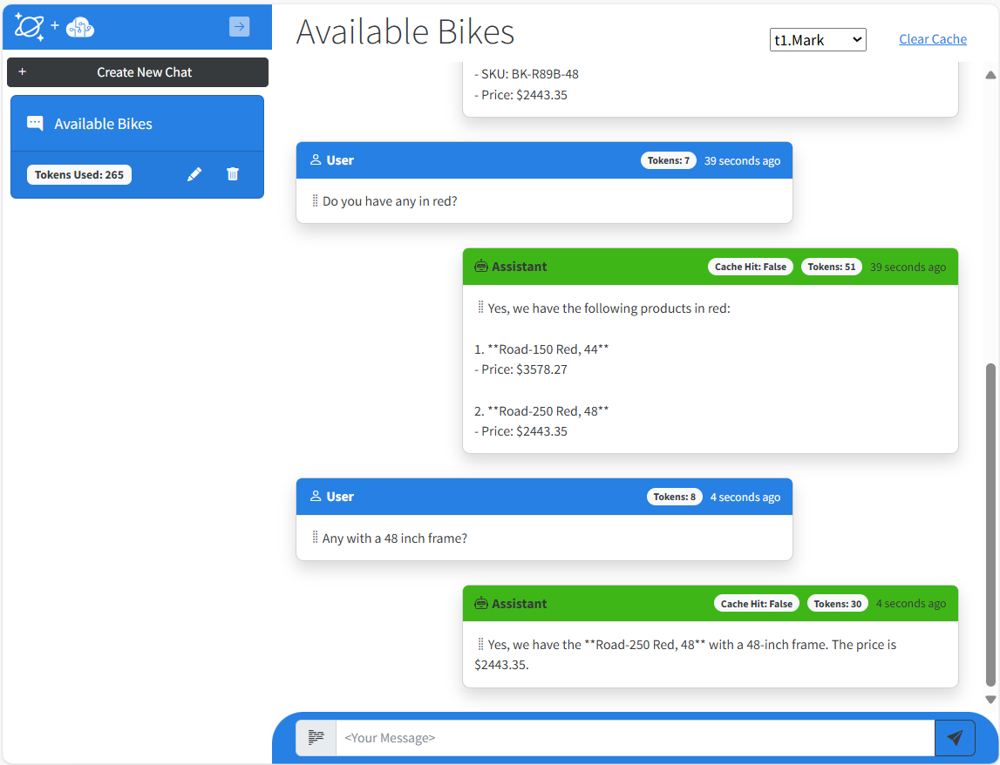
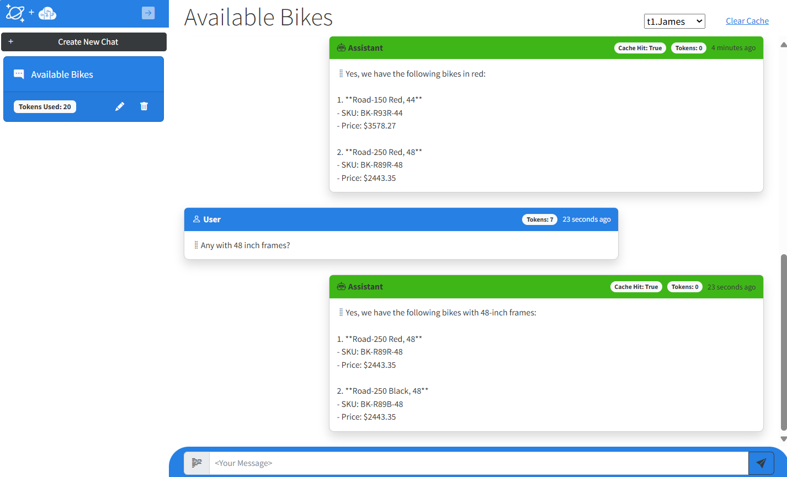
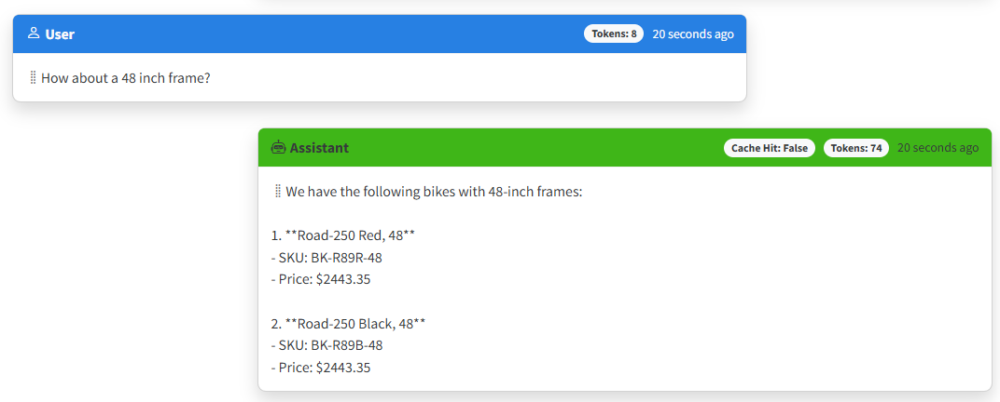

# Quickstart exercises

This document walks you through the concepts implemented in this sample so you can understand it's capabilities and how to do the same.

The underlying dataset used in this sample application is the product catalog from SQL Server's Adventure Works database. This is a bicycle retail scenario. The product catalog contains products you can pose questions of including: bikes, frames, seats, accessories. Products have various attributes such as color, price, etc. and varies based upon the product category. To get more details on this dataset, you can ask what product categories are available and explore the products in the catalog yourself.

# Context window (chat history)

Humans interact with each other through conversations that have some *context* of what is being discussed. OpenAI's ChatGPT can also interact this way with humans. However, this capability is not native to an LLM itself. It must be implemented. Let's explore what happens when we test contextual follow up questions with our LLM where we ask follow up questions that imply an existing context like you would have in a conversation with another person.

## Quickstart: Conversational context
Let's observe this in action. Launch the application in a debug session (F5) from Visual Studio or VS Code, then follow these steps:

1. Start a new Chat Session by clicking, "Create New Chat" in the upper left part of the page.
1. Enter a question, `What bikes do you have?`, the app will respond with a listing of bikes and information about each of them.
1. Enter a follow up without context, `Do you have any in red?`, the app will respond with a list of red bikes.
1. Enter a third follow up, `Any with a 48 inch frame?`, the app will respond with a list of bikes with 48" frames.

The LLM is able to keep context for the conversation and answer appropriately. Also note here the value of the tokens displayed for both the user prompt and the completion generated by the LLM. These are important. We will explore why in this section below.

# Tokens

Large language models require chat history to generate contextually relevant results. But there is a limit how much text you can send to an LLM. Large language models have limits on how much text they can process in a request and output in a response. These limits are measured in **tokens**. Tokens are the compute currency for large language models and represent words or part of a word. On average 4 characters is one token. Because of this limit on tokens, it is necessary to limit how many are consumed in a request and response. This can be a bit tricky. You need to simultaneously ensure enough context for the LLM to generate a correct response, while avoiding negative results of consuming too many tokens which can include incomplete results or unexpected behavior.

In this application we highlight a way to control for token usage by allowing you to configure how large the context window can be (length of chat history). This is done using the configuration value, **MaxConversationTokens** which is stored in the secrets.json or appsettings.json file. 

Another thing that can impact token consumption is when external data is sent to an LLM to provide additional information. This is know as Retrieval Augmented Generation or *RAG Pattern*. In this pattern, data from a database (or any external source) is used to augment or *ground* the LLM by providing additional information for it to generate a response. The amount of data from these external sources can get rather large. It is possible to consume many thousands of tokens per request/response depending on how much data is sent.

A second way to control token consumption is by limiting the amount of data returned by database queries. In this sample this is done using another configuration value, **productMaxResults**. By limiting the amount of data returned, you can control how many tokens can be consumed. However, limiting the amount of items returned from a query isn't very precise.

## Tokenizers

A better method for managing token consumption is to take both the context window and the results from a database and pass it to a tokenizer such as [Tiktoken](https://github.com/openai/tiktoken) to calculate how many tokens the results will consume in a request to an LLM. This application uses the [Microsoft.ML.Tokenizers](https://github.com/microsoft/Tokenizer) (a .NET implementation of OpenAI's Tiktoken) to calculate tokens for the user prompt to store in the chat history.

This sample uses overly simplistic approaches to highlight the impact chat history and RAG Pattern data have on token usage. In a production system, a more complete solution would be to leverage a tokenizer to independently measure chat history and RAG Pattern results, then determine where to reduce the size so that it fits within the maximum token limits for your application's requests to an LLM. These usually involve tokenizers to measure tokens before calling an LLM.

# Semantic Cache

Even with token management in place, generating completions from an LLM are still expensive. They can also be quite slow. This cost and latency increases as the amount of text increases.

Thankfully we can create a cache for this type of solution to reduce both cost and latency. In this sample we introduce a specialized cache called a **semantic cache**. 

Traditional caches are key-value pairs and use an equality match on the key to *get* data. In a semantic cache the keys are vectors (or embeddings) which represent words in a high dimensional space where words with similar meaning or intent are in close proximity to each other dimensionally. As an example, monarch is dimensionally close to king, flower to plant, dog to animal, etc.

## Semantic Cache and Context

Unlike a regular key-value cache, a semantic cache typically does not just store the results from a single request/response pair. This is because an LLM requires context from the chat history to generate a relevant completion. To mimic what an LLM would have returned, you have to match what was originally sent and cached.

Here is a simple mental exercise to illustrate this point. If I'm using a semantic cache that *only caches single prompts* and completions this is what can occur.

1. User asks, `What is the largest lake in North America?` The LLM will respond with *Lake Superior* and some facts and figures about it. Then the *vectorized* prompt and completion get stored in the cache.
1. User asks a follow up, `What is the second largest?` Since this question hasn't been asked before the LLM responds with, `Lake Huron`. Then this get saved to the cache.
1. Now assume a second user asks, `What is the largest stadium North America?` This is a new prompt so the LLM responds with `Michigan Stadium` with some facts and figures.
1. Then second users asks a follow-up, `What is the second largest?` Since this question was asked by the previous user it returns the cached response, `Lake Huron`, which of course is incorrect.

The solution is to *cache the context window* for the conversation. In this way, any user that goes down the same path of questions, will get the contextually correct responses. This is accomplished by vectorizing the context window of prompts to use as the cache key, then saving the latest completion as the cache value. 

## Quickstart: Semantic Cache and Context

In your application, start with a completely clean cache by clicking the *clear cache* at the top right of the page. 

1. Start a new Chat Session by clicking, "Create New Chat" in the upper left part of the page.
1. Enter a question, `What bikes do you have?`, the app will respond with a listing of bikes. 
1. Enter a follow up, `Do you have any in red?`, the app will respond with a list of red bikes.
1. Enter a third follow up, `Any with a 48 inch frame?`, the app will respond with a list of bikes with 48" frames.

Notice how each of the completions generated by the LLM all have values for *Tokens:* and have a *Cache Hit: False*.

Next, select a different user from the drop down at the top of the page.

1. Start a new Chat Session by clicking, "Create New Chat" in the upper left part of the page.
1. Enter a question, `What bikes do you have?`, the app will respond with a listing of bikes. Notice the *Cache Hit: True* and *Tokens: 0* in the response.
1. Enter a follow up, `Do you have any in red?`, the app will respond with a list of red bikes. Also notice its a cache hit.
1. Enter a third follow up, `Any with a 48 inch frame?`, the app will respond with a list of bikes with 48" frames. And of course it hits the cache as well.

## Similarity Score

For a semantic cache a **GET** is done with a specialized **vector query** in which the match is done comparing the proximity of these vectors. The results are a cached completion previously generated by an LLM. Vector queries include a **similarity score** that represents how close the vectors are to each other. Values range from 0 (no similarity) to 1 (exact match).

To execute a vector query for a semantic cache, user text is converted into vectors and then used as the filter predicate to search for similar vectors in the cache. For our semantic cache, we will create a query that returns just one result, and we use a similarity score as a way to dial in, how close the user's intent and words are to the cache's key values. The greater the score, the more similar the words and intent. The lower the score, the less similar the words *and potentially* intent as well.

In practice, setting the similarity score value for a cache can be tricky. To high, and the cache will quickly fill up with multiple responses for very similar questions. To low, and the cache will return irrelevant responses that do not satisfy the user. In some scenarios, developers may opt to return multiple items from the cache, letting the user decide which is relevant.

## Quickstart: Semantic Cache & Similarity Score

Let's try one more prompt to test the similarity score with our cache.

1. In the same chat session, enter a variation of the last prompt from the previous Quickstart, `How about a 48 inch frame?`. Notice the response has *Cache Hit: False* and *Tokens:* is not zero.

This was essentially the same question with the same intent. So why didn't it result in a cache hit? The reason is the similarity score. It defaults to a value of `0.99`. This means that the question must be nearly exactly the same as what was cached.

Let's adjust this and try again.

1. Stop the current debug session.

1. In Visual Studio or VS Code, open **secrets.json** or **appsettings.development.json** if you are using that instead and modify the **CacheSimilarityScore** value and adjust it from `0.99` to `0.90`. Save the file.

1. Restart the app and enter another variation of the last prompt, `How about 48 inch frames?`. This time you should get a cache hit.

Spend time trying different sequences of questions (and follow up questions) and then modifying them with different similarity scores. You can click on **Clear Cache** if you want to start over and do the same series of questions again.

# Semantic Kernel

This project highlights the LLM orchestration SDK created by Microsft Research called, Semantic Kernel. Semantic Kernel is an open-source SDK that lets you easily build agents that can call your existing code. As a highly extensible SDK, you can use Semantic Kernel with models from OpenAI, Azure OpenAI, Hugging Face, and more! You can connect it to various vector databases using built-in connectors. By combining your existing C#, Python, and Java code with these models, you can build agents that answer questions and automate processes.

The usage in this sample is very simple and just show the built-in plugins for OpenAI, intended to just give you a quick start in exploring its features and capabilities.

**Note:** This solution yet doesn't implement the Azure Cosmos DB NoSQL connectors for Semantic Kernel. This will be in an upcoming update for this sample.

## Quickstart: Semantic Kernel
Here we will change all the calls made directly to OpenAI Service to go though Semantic Kernel. Open the solution for the application. Follow the steps:

1. In ChatService, comment the lines that call `_openAiService` then uncomment the ones below that call `_semanticKernelService` in these three places.
    1. `GetChatCompletionAsync()`
    1. `SummarizeChatSessionNameAsync()` 
    1. `GetCacheAsync()`
1. Restart the application.

You won't see any difference in the execution for the application. The purpose of SDK's like Semantic Kernel is to provide a surface area for building more complex types of these applications. Navigate to the Semantic Kernel class and you can see how the built-in OpenAI plugins are used.

# Conclusion

We hope you enjoyed this series of quick starts. Feel free to take this sample and customize and use.
